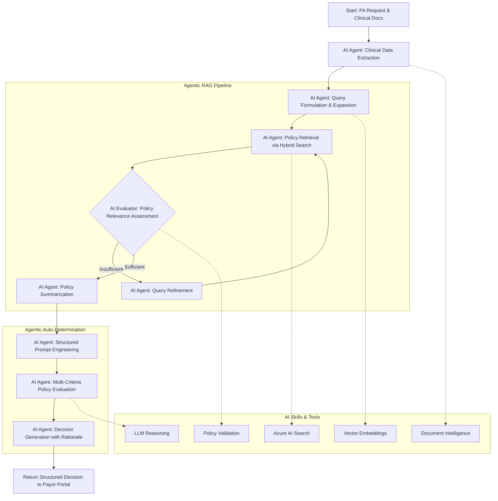

# How AutoAuth Leverages Agentic AI for Prior Authorization

The AutoAuth solution revolutionizes the Prior Authorization (PA) process by employing **Agentic AI** - intelligent, autonomous agents that can reason, plan, and execute complex multi-step workflows. This document details how agentic AI principles transform traditional PA processing from manual, error-prone workflows into intelligent, adaptive systems.

## What is Agentic AI?

Agentic AI represents a paradigm shift from simple prompt-response patterns to intelligent agents capable of:
- **Autonomous Decision Making**: Making complex decisions without human intervention
- **Multi-Step Reasoning**: Breaking down complex problems into manageable steps
- **Adaptive Planning**: Adjusting strategies based on intermediate results
- **Tool Integration**: Dynamically using various tools and services to achieve goals
- **Self-Correction**: Learning from failures and adapting approaches

## Agentic Flow Architecture



## Core Agentic AI Components

### 1. **Intelligent Document Processing Agent**

**Purpose**: Autonomously extract, validate, and structure clinical information from unstructured documents.

**Agentic Capabilities**:
- **Named Entity Recognition (NER)**: Automatically identifies and categorizes medical entities (diagnoses, medications, lab results)
- **OCR Error Correction**: Self-corrects common OCR mistakes using medical context
- **Data Validation**: Ensures extracted information meets clinical standards
- **Multi-Modal Processing**: Handles various document types (PDFs, images, clinical notes)

**Key Features**:
```python
# Intelligent extraction with field-level validation
clinical_info = await agent.extract_clinical_data(
    documents=image_files,
    validation_schema=ClinicalInformation,
    error_correction=True
)
```

### 2. **Agentic Query Expansion & Formulation**

**Purpose**: Intelligently expand and refine search queries to maximize policy retrieval accuracy.

**Agentic Capabilities**:
- **Semantic Understanding**: Understands medical terminology and relationships
- **Synonym Generation**: Automatically includes medical synonyms and alternative terms
- **Context-Aware Expansion**: Considers diagnosis, medication, and procedure contexts
- **Precision-Recall Optimization**: Balances comprehensive coverage with relevance

**Example Process**:
```jinja
# From the prompt templates
"Prior authorization policy for {{ medication }} for {{ diagnosis }}.
Related terms: {{ synonyms }}, {{ alternative_names }},
dosage requirements, contraindications, prior therapy requirements."
```

### 3. **Hybrid Retrieval-Augmented Generation (RAG) Agent**

**Purpose**: Intelligently search and retrieve the most relevant PA policies using multiple search strategies.

**Agentic Capabilities**:
- **Hybrid Search Strategy**: Combines vector semantic search with BM25 lexical search
- **Query Classification**: Determines optimal search strategy (semantic vs. keyword)
- **Relevance Evaluation**: Assesses retrieved policies for relevance and completeness
- **Adaptive Retrieval**: Refines search strategy based on initial results

**Search Flow**:
```python
class AgenticRAG:
    async def retrieve_policies(self, clinical_info):
        # 1. Query expansion with medical context
        expanded_query = await self.expand_query(clinical_info)

        # 2. Hybrid search execution
        policies = await self.hybrid_search(expanded_query)

        # 3. Relevance evaluation
        if not self.evaluate_relevance(policies):
            # 4. Adaptive refinement
            return await self.refine_and_retry(clinical_info)

        return policies
```

### 4. **Policy Evaluation & Reasoning Agent**

**Purpose**: Apply complex medical reasoning to evaluate PA requests against policy criteria.

**Agentic Capabilities**:
- **Multi-Criteria Analysis**: Evaluates multiple policy requirements simultaneously
- **Evidence-Based Reasoning**: Links clinical evidence to specific policy criteria
- **Uncertainty Handling**: Identifies gaps and requests additional information when needed
- **Compliance Assessment**: Ensures decisions align with regulatory requirements

**Decision Framework**:
```python
# Multi-step reasoning process
decision_process = [
    "Extract all policy criteria",
    "Map clinical information to criteria",
    "Assess compliance for each criterion",
    "Identify gaps or missing information",
    "Generate evidence-based decision",
    "Provide detailed rationale"
]
```

### 5. **Autonomous Decision Generation Agent**

**Purpose**: Generate comprehensive, auditable decisions with detailed reasoning.

**Agentic Capabilities**:
- **Structured Decision Making**: Follows standardized evaluation frameworks
- **Rationale Generation**: Provides clear explanations for each decision
- **Policy Citation**: References specific policy sections supporting decisions
- **Transparency**: Ensures decisions are auditable and explainable

## Agentic AI Skills & Plugin Architecture

### Skills Manager
The AutoAuth system uses a modular skills architecture where AI agents can dynamically load and use specialized capabilities:

```python
# Available agentic skills
skills = [
    "retrieval",      # Policy search and retrieval
    "evaluation",     # Clinical assessment and validation
    "rewriting",      # Query refinement and optimization
    "main"           # Core workflow orchestration
]
```

### Dynamic Function Calling
Agents can dynamically invoke tools and services based on context:

- **Document Intelligence**: For OCR and document processing
- **Azure AI Search**: For policy retrieval and semantic search
- **Vector Embeddings**: For similarity matching and semantic understanding
- **LLM Reasoning**: For complex medical reasoning and decision making
- **Validation Services**: For data quality and compliance checking

## Agentic Workflows in Action

### Workflow 1: Intelligent Policy Matching

1. **Clinical Context Analysis**: Agent analyzes diagnosis, medications, and patient history
2. **Query Formulation**: Agent constructs optimized search queries with medical synonyms
3. **Multi-Strategy Search**: Agent employs hybrid search techniques
4. **Relevance Assessment**: Agent evaluates policy matches for completeness
5. **Adaptive Refinement**: Agent refines approach if initial results are insufficient

### Workflow 2: Automated Decision Making

1. **Policy Decomposition**: Agent breaks down complex policies into discrete criteria
2. **Evidence Mapping**: Agent maps clinical information to specific policy requirements
3. **Gap Analysis**: Agent identifies missing information or unclear criteria
4. **Decision Synthesis**: Agent synthesizes findings into clear approve/deny/more-info decisions
5. **Rationale Generation**: Agent provides detailed, auditable explanations

## Benefits of Agentic AI in Prior Authorization

### 🚀 **Enhanced Accuracy**
- **Contextual Understanding**: Agents understand medical terminology and relationships
- **Multi-Perspective Analysis**: Considers clinical, regulatory, and administrative factors
- **Error Reduction**: Self-validates and corrects common mistakes

### ⚡ **Improved Efficiency**
- **Parallel Processing**: Multiple agents work simultaneously on different aspects
- **Adaptive Learning**: Agents improve performance based on outcomes
- **Automated Workflows**: Reduces manual intervention requirements

### 🔍 **Better Transparency**
- **Explainable Decisions**: Clear reasoning chains for all decisions
- **Audit Trails**: Complete record of agent actions and reasoning
- **Policy Citations**: Specific references to supporting policy sections

### 🎯 **Regulatory Compliance**
- **CMS 2026 Alignment**: Built-in compliance with regulatory requirements
- **FHIR Integration**: Supports healthcare interoperability standards
- **Documentation Standards**: Maintains required documentation for audits

## Technical Implementation

### Agent Configuration
```python
agent = Agent(
    name="PA_Processing_Agent",
    instructions="Analyze prior authorization requests using clinical evidence and policy criteria",
    skills=["retrieval", "evaluation", "main"],
    execution_settings=OpenAIChatPromptExecutionSettings(
        temperature=0.1,  # Low temperature for consistent decisions
        max_tokens=4000,
        function_choice_behavior=FunctionChoiceBehavior.AUTO
    )
)
```

### Agentic Pipeline Execution
```python
class PAProcessingPipeline:
    async def process_agentic_workflow(self, clinical_data):
        # 1. Agentic clinical extraction
        structured_data = await self.clinical_agent.extract(clinical_data)

        # 2. Agentic policy retrieval
        relevant_policies = await self.rag_agent.retrieve_policies(structured_data)

        # 3. Agentic decision making
        decision = await self.decision_agent.evaluate(
            clinical_data=structured_data,
            policies=relevant_policies
        )

        return decision
```

## Future Enhancements

### Advanced Agentic Capabilities
- **Multi-Agent Collaboration**: Specialized agents for different medical domains
- **Continuous Learning**: Agents that improve from feedback and outcomes
- **Predictive Analytics**: Agents that anticipate approval likelihood
- **Real-Time Adaptation**: Dynamic strategy adjustment based on success rates

### Integration Opportunities
- **EHR Integration**: Direct integration with Electronic Health Records
- **Provider Portals**: Real-time PA status updates and recommendations
- **Quality Metrics**: Automated tracking of decision accuracy and efficiency
- **Regulatory Reporting**: Automated compliance reporting and analytics

---

The AutoAuth solution demonstrates how Agentic AI can transform complex healthcare workflows by providing intelligent, autonomous, and transparent processing capabilities that enhance both accuracy and efficiency while maintaining regulatory compliance.
