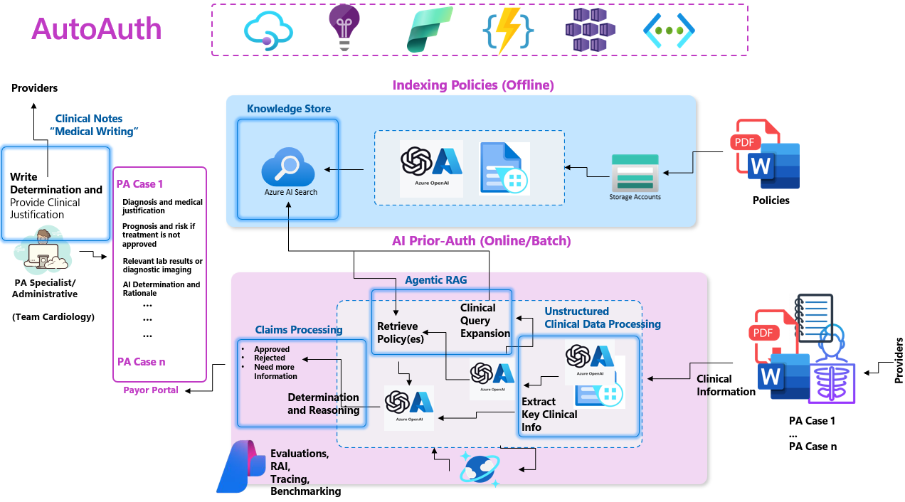
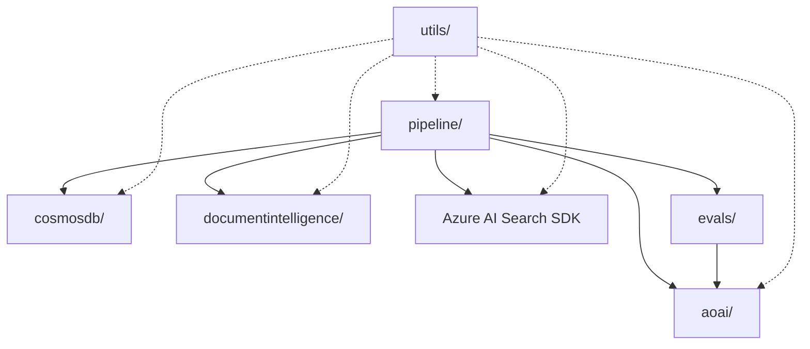
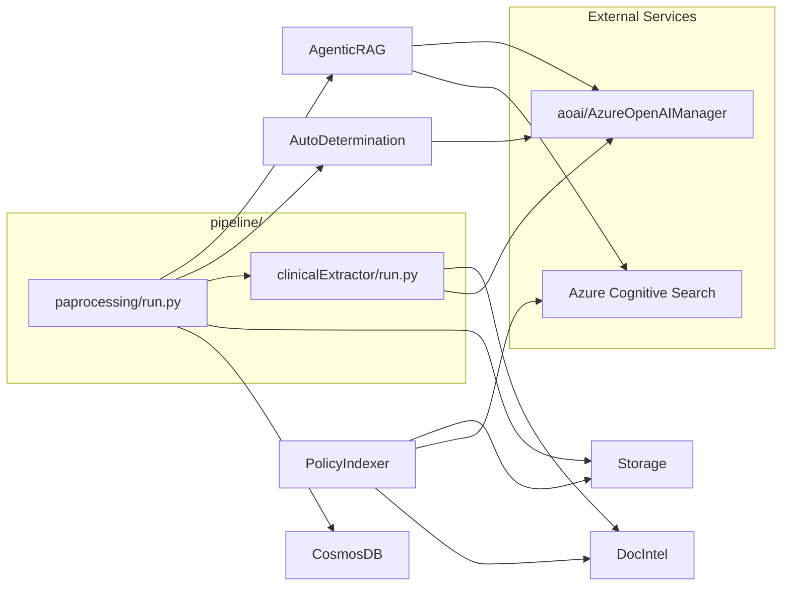
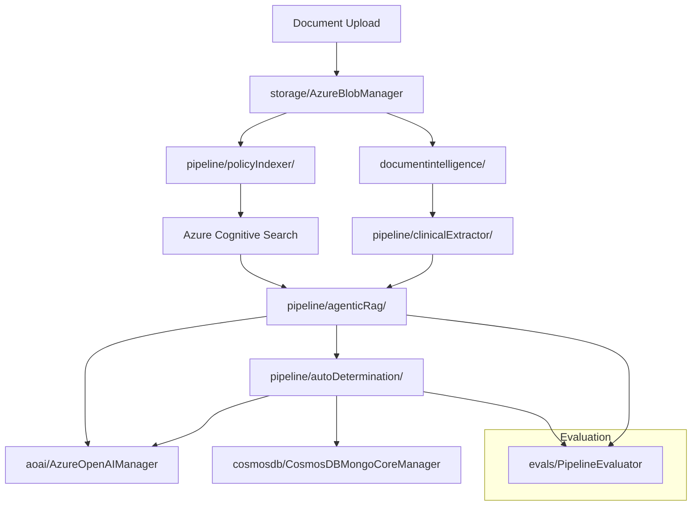

# ⚙️ Technical Architecture

AutoAuth’s architecture orchestrates multiple Azure services and techniques to seamlessly process requests, retrieve policies, and generate recommendations.

## High-Level Overview

- **Knowledge Base Construction**: Establish a centralized repository of Prior Authorization (PA) policies and guidelines to streamline the decision-making process.
- **Unstructured Clinical Data Processing**: Extract and structure patient-specific clinical information from raw data sources using advanced Large Language Model (LLM)-based techniques.
- **Agentic RAG**: Identify the most relevant PA policy for a clinical case using a multi-layered retrieval approach, supported by Azure AI Search and LLM as the formulator and judge, guided by agentic pipelines.
- **Claims Processing**: Leverage Azure OpenAI to evaluate policies against clinical inputs, cross-reference patient, physician, and clinical details against policy criteria. Classify the Prior Authorization (PA) claim as Approved, Denied, or Needs More Information, providing clear, evidence-based explanations and policy references to support a comprehensive human final determination.

## Components

| Component                 | Role                               |
|---------------------------|-------------------------------------|
| Azure OpenAI              | LLMs for reasoning and decision logic |
| Azure Cognitive Search    | Hybrid retrieval (semantic + keyword) |
| Document Intelligence      | OCR and data extraction              |
| Azure Storage             | Document storage                     |
| Azure Bicep Templates     | Automated infrastructure deployment  |
| Semantic Kernel           | Agentic orchestration of retrieval and reasoning |
| Azure AI Studio (LLMOps)  | Model evaluation, prompt optimization, and performance logging |

This integrated design enables a dynamic, AI-driven PA process that is scalable, auditable, and ready for continuous improvement.

# Architecture Overview

AutoAuth is designed with a modular architecture to ensure scalability, maintainability, and extensibility.

## High-Level System Flow

### Key Components
- **Pipeline**: Orchestrates business logic workflows.
- **AOAI**: Integrates Azure OpenAI for advanced AI capabilities.
- **CosmosDB**: Provides persistent storage for structured data.
- **Document Intelligence**: Extracts structured data from unstructured documents.
- **Azure AI Search SDK**: Enables intelligent policy retrieval.
- **Evals**: Validates pipeline performance and accuracy.
- **Utils**: Shared utilities for logging, configuration, and helpers.

## Pipeline-Centric Architecture

## Data Flow Architecture

## Next Steps
- Learn more about [Workflows](workflows-overview.md).
- Dive into [Technical Implementation](technical-implementation.md).
- Refer to the [Deployment Guide](azd_deployment.md) for Azure deployment instructions.
