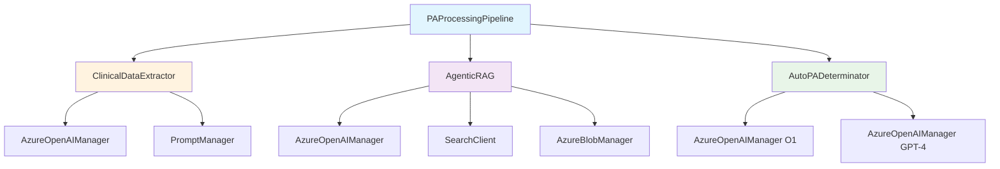

# AutoAuth Technical Implementation Guide

This document provides detailed technical implementation information for developers working with AutoAuth's pipeline components, including API specifications, configuration options, and integration patterns.

## Pipeline Architecture Overview

### PAProcessingPipeline Implementation

The main orchestration pipeline coordinates all processing steps:

```python
class PAProcessingPipeline:
    """
    Orchestrates the Prior Authorization Processing Pipeline, coordinating:
    - File upload and image extraction
    - Clinical data extraction
    - Query expansion and policy retrieval
    - Final determination generation
    """

    async def run(self, uploaded_files, streamlit=False, caseId=None, use_o1=False):
        """
        Main processing workflow:
        1. Process and extract images from uploaded PDF files
        2. Extract patient, physician, and clinical data
        3. Expand query and search for relevant policy
        4. Retrieve and possibly summarize policy
        5. Generate final determination
        6. Store and log results
        """
```

### Component Integration Pattern



## Clinical Data Extraction Implementation

### ClinicalDataExtractor Class

```python
class ClinicalDataExtractor:
    """
    Extracts structured clinical data from document images using AI.
    Implements concurrent processing for patient, physician, and clinical data.
    """

    async def run(self, image_files, PatientInformation, PhysicianInformation, ClinicalInformation):
        """
        Extract all clinical data types concurrently.

        Returns:
            Dict containing patient_data, physician_data, clinician_data
        """
        # Concurrent task execution
        patient_task = self.extract_patient_data(image_files, PatientInformation)
        physician_task = self.extract_physician_data(image_files, PhysicianInformation)
        clinical_task = self.extract_clinician_data(image_files, ClinicalInformation)

        # Await all tasks simultaneously
        results = await asyncio.gather(patient_task, physician_task, clinical_task)

        return {
            "patient_data": results[0][0],
            "physician_data": results[1][0],
            "clinician_data": results[2][0]
        }
```

### Data Extraction Configuration

```yaml
# Clinical extraction configuration
clinical_extraction:
  patient_extraction:
    system_prompt: "ner_patient_system.jinja"
    user_prompt: "ner_patient_user.jinja"
    max_tokens: 4096
    temperature: 0.1
    top_p: 0.95

  physician_extraction:
    system_prompt: "ner_physician_system.jinja"
    user_prompt: "ner_physician_user.jinja"
    max_tokens: 4096
    temperature: 0.1
    top_p: 0.95

  clinical_extraction:
    system_prompt: "ner_clinician_system.jinja"
    user_prompt: "ner_clinician_user.jinja"
    max_tokens: 4096
    temperature: 0.1
    top_p: 0.95
```

### Pydantic Model Validation

```python
class PatientInformation(BaseModel):
    """Patient data schema with validation."""
    patient_name: Optional[str] = Field(None, description="Patient full name")
    date_of_birth: Optional[str] = Field(None, description="Patient DOB")
    member_id: Optional[str] = Field(None, description="Insurance member ID")
    diagnosis_codes: Optional[List[str]] = Field(default_factory=list)
    medical_history: Optional[str] = Field(None, description="Relevant medical history")

class PhysicianInformation(BaseModel):
    """Physician data schema with validation."""
    physician_name: Optional[str] = Field(None, description="Physician name")
    npi_number: Optional[str] = Field(None, description="National Provider Identifier")
    specialty: Optional[str] = Field(None, description="Medical specialty")
    practice_name: Optional[str] = Field(None, description="Practice or hospital name")
    treatment_rationale: Optional[str] = Field(None, description="Clinical justification")

class ClinicalInformation(BaseModel):
    """Clinical data schema with validation."""
    primary_diagnosis: Optional[str] = Field(None, description="Primary diagnosis")
    icd10_codes: Optional[List[str]] = Field(default_factory=list)
    requested_medication: Optional[str] = Field(None, description="Requested drug")
    dosage: Optional[str] = Field(None, description="Dosage and frequency")
    duration: Optional[str] = Field(None, description="Treatment duration")
```

## Agentic RAG Implementation

### AgenticRAG Class Structure

```python
class AgenticRAG:
    """
    Implements intelligent policy retrieval with agentic evaluation.
    """

    async def run(self, clinical_info, max_retries=3):
        """
        Main agentic RAG workflow:
        1. Query expansion based on clinical information
        2. Hybrid search (vector + BM25) for policy retrieval
        3. AI evaluation of policy relevance
        4. Iterative refinement if needed
        """
        for attempt in range(max_retries):
            # Step 1: Query expansion
            expanded_query = await self._expand_query(clinical_info)

            # Step 2: Policy search
            search_results = await self._hybrid_search(expanded_query)

            # Step 3: AI evaluation
            evaluation = await self._evaluate_policies(search_results, clinical_info)

            if evaluation["status"] == "APPROVED":
                return self._prepare_results(search_results, evaluation)
            elif evaluation["status"] == "NEEDS_MORE_INFO":
                clinical_info = self._refine_query(clinical_info, evaluation["feedback"])
                continue
            else:  # INSUFFICIENT
                break

        return {"policies": [], "status": "FAILED", "reason": "No suitable policies found"}
```

### Search Implementation Details

```python
async def _hybrid_search(self, query):
    """
    Implements hybrid search combining vector and lexical approaches.
    """
    # Vector search for semantic similarity
    vector_query = VectorizableTextQuery(
        text=query,
        k_nearest_neighbors=5,
        fields="vector",
        weight=0.5
    )

    # Execute hybrid search
    results = self.search_client.search(
        search_text=query,
        vector_queries=[vector_query],
        query_type=QueryType.SEMANTIC,
        semantic_configuration_name="my-semantic-config",
        query_caption=QueryCaptionType.EXTRACTIVE,
        query_answer=QueryAnswerType.EXTRACTIVE,
        top=5
    )

    return list(results)
```

### AI Policy Evaluation

```python
async def _evaluate_policies(self, search_results, clinical_info):
    """
    AI-powered evaluation of policy relevance using specialized prompts.
    """
    evaluation_prompt = self.prompt_manager.create_evaluation_prompt(
        search_results, clinical_info
    )

    response = await self.azure_openai_client.generate_chat_response(
        query=evaluation_prompt,
        system_message_content=self.evaluator_system_prompt,
        response_format="json_object",
        max_tokens=2048,
        temperature=0.1
    )

    return json.loads(response["response"])
```

## Auto-Determination Implementation

### AutoPADeterminator Class

```python
class AutoPADeterminator:
    """
    Generates final PA determinations using advanced AI models with fallback logic.
    """

    async def run(self, patient_info, physician_info, clinical_info, policy_text,
                  summarize_policy_callback, use_o1=False, caseId=None):
        """
        Generate final determination with O1/GPT-4 fallback and retry logic.
        """
        # Create structured prompt
        user_prompt = self.prompt_manager.create_prompt_pa(
            patient_info, physician_info, clinical_info, policy_text, use_o1
        )

        # Try O1 model first if available
        if use_o1:
            try:
                return await self._generate_with_o1(user_prompt, policy_text,
                                                  summarize_policy_callback)
            except Exception as e:
                self.logger.info(f"O1 model failed, falling back to GPT-4: {e}")
                use_o1 = False

        # Fallback to GPT-4 with retry logic
        if not use_o1:
            return await self._generate_with_gpt4(user_prompt, policy_text,
                                                 summarize_policy_callback)
```

### Model-Specific Implementation

```python
async def _generate_with_o1(self, prompt, policy_text, summarize_callback):
    """O1 model implementation with context length management."""
    try:
        response = await self.azure_openai_client_o1.generate_chat_response_o1(
            query=prompt,
            conversation_history=[],
            max_completion_tokens=15000
        )

        # Handle context length exceeded
        if response == "maximum context length":
            summarized_policy = await summarize_callback(policy_text)
            summarized_prompt = self.prompt_manager.create_prompt_pa(
                self.patient_info, self.physician_info, self.clinical_info,
                summarized_policy, True
            )
            response = await self.azure_openai_client_o1.generate_chat_response_o1(
                query=summarized_prompt,
                conversation_history=[],
                max_completion_tokens=15000
            )

        return response["response"], response.get("conversation_history", [])
    except Exception as e:
        self.logger.error(f"O1 model processing failed: {e}")
        raise

async def _generate_with_gpt4(self, prompt, policy_text, summarize_callback):
    """GPT-4 implementation with retry logic."""
    max_retries = 2
    for attempt in range(1, max_retries + 1):
        try:
            response = await self.azure_openai_client.generate_chat_response(
                query=prompt,
                system_message_content=self.system_prompt,
                conversation_history=[],
                response_format="text",
                max_tokens=self.max_tokens,
                top_p=self.top_p,
                temperature=self.temperature
            )

            # Handle context length exceeded
            if response == "maximum context length":
                summarized_policy = await summarize_callback(policy_text)
                summarized_prompt = self.prompt_manager.create_prompt_pa(
                    self.patient_info, self.physician_info, self.clinical_info,
                    summarized_policy, False
                )
                response = await self.azure_openai_client.generate_chat_response(
                    query=summarized_prompt,
                    system_message_content=self.system_prompt,
                    conversation_history=[],
                    response_format="text",
                    max_tokens=self.max_tokens,
                    top_p=self.top_p,
                    temperature=self.temperature
                )

            return response["response"], response.get("conversation_history", [])

        except Exception as e:
            if attempt < max_retries:
                self.logger.warning(f"GPT-4 attempt {attempt} failed, retrying: {e}")
                continue
            else:
                self.logger.error(f"All GPT-4 retries failed: {e}")
                raise
```

## Configuration Management

### Settings Structure

```yaml
# Main configuration file: src/pipeline/paprocessing/settings.yaml
remote_blob_paths:
  container_name: "pre-auth-policies"
  raw_uploaded_files: "raw_attachments"
  processed_images: "processed_docs_images"
  remote_dir_base: "pa_proccesing_runs"

azure_openai:
  api_version: "2024-02-15-preview"
  max_tokens: 4096
  temperature: 0.1
  top_p: 0.95
  frequency_penalty: 0
  presence_penalty: 0
```

### Environment Variables

```bash
# Azure OpenAI Configuration
AZURE_OPENAI_ENDPOINT=https://your-resource.openai.azure.com/
AZURE_OPENAI_API_KEY=your-api-key
AZURE_OPENAI_CHAT_DEPLOYMENT_ID=gpt-4
AZURE_OPENAI_O1_DEPLOYMENT_ID=o1-preview

# Azure Search Configuration
AZURE_SEARCH_SERVICE_ENDPOINT=https://your-search.search.windows.net
AZURE_SEARCH_ADMIN_KEY=your-search-key
AZURE_SEARCH_INDEX_NAME=policies-index

# Azure Storage Configuration
AZURE_BLOB_STORAGE_ACCOUNT_NAME=yourstorageaccount
AZURE_BLOB_STORAGE_ACCOUNT_KEY=your-storage-key
AZURE_BLOB_CONTAINER_NAME=policies

# Azure Cosmos DB Configuration
AZURE_COSMOS_DB_CONNECTION=mongodb://your-cosmos-connection
AZURE_COSMOS_DB_DATABASE_NAME=autoauth
AZURE_COSMOS_DB_COLLECTION_NAME=cases

# Azure Document Intelligence
AZURE_DOCUMENT_INTELLIGENCE_ENDPOINT=https://your-di.cognitiveservices.azure.com/
AZURE_DOCUMENT_INTELLIGENCE_KEY=your-di-key
```

## Prompt Engineering Templates

### System Prompt Examples

```jinja
{# Patient extraction system prompt #}
You are an expert medical data extraction AI specializing in patient information extraction from clinical documents and prior authorization forms.

Your task is to extract accurate patient information including demographics, medical history, insurance details, and relevant clinical data.

## Extraction Guidelines:
1. Extract only factual information present in the documents
2. Use standard medical terminology and coding (ICD-10, CPT)
3. Maintain patient privacy and handle PHI appropriately
4. Provide structured JSON output following the specified schema
5. Mark fields as null if information is not available

## Data Quality Requirements:
- Verify insurance member IDs and policy numbers
- Validate date formats (YYYY-MM-DD)
- Extract complete diagnosis codes with descriptions
- Include relevant medical history and comorbidities
```

```jinja
{# Auto-determination system prompt #}
You are an expert Prior Authorization (PA) medical reviewer with extensive knowledge of healthcare policies, clinical guidelines, and regulatory requirements.

Your role is to analyze PA requests and make evidence-based decisions following these principles:

## Decision Framework:
1. **Policy Compliance**: Evaluate all clinical information against specific policy criteria
2. **Medical Necessity**: Assess clinical appropriateness and medical necessity
3. **Evidence-Based Medicine**: Apply clinical guidelines and best practices
4. **Regulatory Compliance**: Ensure decisions meet regulatory requirements

## Decision Categories:
- **APPROVED**: All policy criteria are met with sufficient clinical evidence
- **DENIED**: Clear policy violations or clinical contraindications
- **MORE INFORMATION NEEDED**: Insufficient data for definitive determination

## Output Requirements:
- Provide detailed rationale for all decisions
- Reference specific policy sections and clinical evidence
- Include clear next steps for denied or pending requests
- Maintain professional, objective tone throughout analysis
```

### User Prompt Templates

```jinja
{# Clinical extraction user prompt #}
Please extract clinical information from the provided medical documents and PA forms.

## Clinical Information to Extract:

### Primary Focus:
- **Primary Diagnosis**: Main condition requiring treatment
- **ICD-10 Codes**: All relevant diagnosis codes
- **Requested Treatment**: Specific medication or procedure
- **Clinical Justification**: Medical necessity rationale

### Secondary Information:
- **Comorbidities**: Relevant additional conditions
- **Prior Treatments**: Previous therapies and outcomes
- **Laboratory Results**: Relevant test results and values
- **Treatment History**: Response to previous interventions

### Treatment Details:
- **Medication Specifics**: Drug name, strength, formulation
- **Dosing Regimen**: Dose, frequency, duration
- **Administration Route**: Oral, injection, infusion, etc.
- **Treatment Duration**: Expected length of therapy

## Output Format:
Provide structured JSON following the ClinicalInformation schema with all available data accurately extracted from the documents.

Document Images: {{ image_files }}
```

```jinja
{# PA determination user prompt #}
## Prior Authorization Analysis

Please analyze this prior authorization request and provide a comprehensive decision.

### Patient Information:
{{ patient_info | tojson(indent=2) }}

### Physician Information:
{{ physician_info | tojson(indent=2) }}

### Clinical Information:
{{ clinical_info | tojson(indent=2) }}

### Applicable Policy:
{{ policy_text }}

## Analysis Requirements:

### 1. Policy Criteria Assessment
- Review all policy requirements systematically
- Map clinical information to specific policy criteria
- Identify any gaps or missing information

### 2. Medical Necessity Evaluation
- Assess clinical appropriateness of requested treatment
- Consider alternative treatments and their outcomes
- Evaluate urgency and medical necessity

### 3. Evidence-Based Decision
- Make determination based on policy compliance and clinical evidence
- Provide detailed rationale with specific references
- Include clear next steps if additional information is needed

## Decision Format:
Provide a structured response including:
1. **Final Decision**: APPROVED/DENIED/MORE INFORMATION NEEDED
2. **Detailed Rationale**: Evidence-based explanation
3. **Policy References**: Specific policy sections cited
4. **Next Steps**: Required actions if applicable
```

## API Integration Patterns

### REST API Endpoints

```python
# FastAPI endpoint implementation
@app.post("/process_pa")
async def process_pa(request: PAProcessingRequest):
    """
    Process a prior authorization request.

    Request body:
    {
        "uploaded_files": ["file1.pdf", "file2.pdf"],
        "caseId": "optional-case-id",
        "use_o1": false,
        "streamlit": false
    }

    Response:
    {
        "caseId": "generated-or-provided-id",
        "status": "success|error",
        "message": "Processing completed successfully",
        "results": {
            "final_determination": "...",
            "processing_time": 45.2,
            "clinical_data": {...},
            "policy_match": {...}
        }
    }
    """
    pipeline = PAProcessingPipeline(caseId=request.caseId)

    try:
        await pipeline.run(
            uploaded_files=request.uploaded_files,
            streamlit=request.streamlit,
            use_o1=request.use_o1
        )

        return {
            "caseId": pipeline.caseId,
            "status": "success",
            "message": "PA processing completed successfully",
            "results": pipeline.results.get(pipeline.caseId, {})
        }
    except Exception as e:
        logger.error(f"PA processing failed: {e}")
        return {
            "caseId": pipeline.caseId,
            "status": "error",
            "message": str(e),
            "results": {}
        }
```

### Webhook Integration

```python
# Webhook for external system integration
@app.post("/webhook/pa_completed")
async def pa_completion_webhook(payload: PACompletionPayload):
    """
    Webhook endpoint for PA completion notifications.
    Integrates with external EHR/payor systems.
    """
    try:
        # Validate webhook signature
        validate_webhook_signature(payload.signature, payload.data)

        # Process completion event
        result = await process_pa_completion(payload.caseId, payload.decision)

        # Notify external systems
        await notify_external_systems(payload.caseId, result)

        return {"status": "acknowledged", "caseId": payload.caseId}

    except Exception as e:
        logger.error(f"Webhook processing failed: {e}")
        raise HTTPException(status_code=500, detail=str(e))
```

## Testing and Evaluation

### Unit Testing Patterns

```python
class TestClinicalDataExtractor(unittest.TestCase):
    """Test suite for clinical data extraction."""

    def setUp(self):
        self.extractor = ClinicalDataExtractor(
            azure_openai_client=mock_aoai_client,
            prompt_manager=mock_prompt_manager,
            caseId="TEST-001"
        )

    async def test_patient_data_extraction(self):
        """Test patient data extraction with mock data."""
        mock_images = ["test_image1.png", "test_image2.png"]

        result = await self.extractor.extract_patient_data(
            mock_images, PatientInformation
        )

        self.assertIsInstance(result[0], PatientInformation)
        self.assertIsNotNone(result[0].patient_name)
        self.assertTrue(len(result[1]) > 0)  # conversation history

    async def test_concurrent_extraction(self):
        """Test concurrent extraction of all data types."""
        mock_images = ["test_image.png"]

        result = await self.extractor.run(
            mock_images,
            PatientInformation,
            PhysicianInformation,
            ClinicalInformation
        )

        self.assertIn("patient_data", result)
        self.assertIn("physician_data", result)
        self.assertIn("clinician_data", result)
```

### Integration Testing

```python
class TestPAProcessingIntegration(unittest.TestCase):
    """Integration tests for complete PA processing workflow."""

    async def test_end_to_end_processing(self):
        """Test complete PA processing pipeline."""
        pipeline = PAProcessingPipeline(caseId="INTEGRATION-TEST-001")

        test_files = ["test_data/sample_pa_form.pdf"]

        await pipeline.run(
            uploaded_files=test_files,
            use_o1=False
        )

        # Verify results
        results = pipeline.results.get(pipeline.caseId)
        self.assertIsNotNone(results)
        self.assertIn("final_determination", results)
        self.assertIn("clinical_data", results)
```

### Performance Testing

```python
async def performance_test_concurrent_processing():
    """Test performance with multiple concurrent PA requests."""
    import asyncio
    import time

    start_time = time.time()

    # Create multiple pipeline instances
    pipelines = [
        PAProcessingPipeline(caseId=f"PERF-TEST-{i:03d}")
        for i in range(10)
    ]

    # Process concurrently
    tasks = [
        pipeline.run(uploaded_files=["test_file.pdf"])
        for pipeline in pipelines
    ]

    await asyncio.gather(*tasks)

    end_time = time.time()
    processing_time = end_time - start_time

    print(f"Processed 10 cases in {processing_time:.2f} seconds")
    print(f"Average time per case: {processing_time/10:.2f} seconds")
```

## Monitoring and Observability

### Logging Implementation

```python
# Comprehensive logging setup
import logging
from src.utils.ml_logging import get_logger

class PAProcessingPipeline:
    def __init__(self, caseId=None):
        self.caseId = caseId or str(uuid.uuid4())
        self.logger = get_logger(
            name=f"PAProcessing-{self.caseId}",
            level=logging.INFO,
            tracing_enabled=True
        )

    async def run(self, uploaded_files, **kwargs):
        self.logger.info(
            f"PA processing started for case {self.caseId}",
            extra={
                "custom_dimensions": {
                    "caseId": self.caseId,
                    "file_count": len(uploaded_files),
                    "use_o1": kwargs.get("use_o1", False)
                }
            }
        )

        try:
            # Processing steps...
            self.logger.info(f"PA processing completed for case {self.caseId}")
        except Exception as e:
            self.logger.error(
                f"PA processing failed for case {self.caseId}: {e}",
                exc_info=True
            )
            raise
```

### Metrics Collection

```python
# Performance metrics tracking
class MetricsCollector:
    def __init__(self):
        self.metrics = {
            "processing_times": [],
            "success_rates": {},
            "error_counts": {},
            "model_usage": {"o1": 0, "gpt4": 0}
        }

    def record_processing_time(self, caseId: str, duration: float):
        self.metrics["processing_times"].append({
            "caseId": caseId,
            "duration": duration,
            "timestamp": datetime.now().isoformat()
        })

    def record_success(self, pipeline_name: str):
        if pipeline_name not in self.metrics["success_rates"]:
            self.metrics["success_rates"][pipeline_name] = {"success": 0, "total": 0}
        self.metrics["success_rates"][pipeline_name]["success"] += 1
        self.metrics["success_rates"][pipeline_name]["total"] += 1

    def get_performance_summary(self):
        return {
            "avg_processing_time": np.mean([m["duration"] for m in self.metrics["processing_times"]]),
            "success_rates": {
                k: v["success"] / v["total"]
                for k, v in self.metrics["success_rates"].items()
            },
            "total_cases_processed": len(self.metrics["processing_times"])
        }
```

---

## Security Considerations

### Data Protection
- **PHI Handling**: All patient health information encrypted in transit and at rest
- **Access Controls**: Role-based access to API endpoints and data
- **Audit Logging**: Complete audit trail for all data access and processing
- **Data Retention**: Configurable data retention policies for compliance

### API Security
- **Authentication**: OAuth 2.0 / JWT token-based authentication
- **Rate Limiting**: API rate limiting to prevent abuse
- **Input Validation**: Comprehensive input validation and sanitization
- **HTTPS Only**: All communications over secure HTTPS connections

### Infrastructure Security
- **Network Isolation**: Private networks and VPC configurations
- **Secrets Management**: Azure Key Vault for sensitive configuration
- **Monitoring**: Real-time security monitoring and alerting
- **Compliance**: HIPAA, SOC 2, and other healthcare compliance standards
