# AutoAuth Solution Accelerator - SDK Technical Details

The AutoAuth solution accelerator transforms manual prior authorization processes through intelligent automation, leveraging advanced AI capabilities for document processing, policy analysis, and clinical decision-making. This comprehensive overview details the application's architecture, workflow implementation, and component interactions.

## Executive Summary

AutoAuth addresses the healthcare industry's most pressing administrative challenge by automating prior authorization workflows that traditionally require **13 hours per week** of physician time. The solution uses **agentic AI** to intelligently process clinical documents, retrieve relevant policies, and generate accurate authorization decisions while maintaining full audit trails and regulatory compliance.

### Key Capabilities
- **Document Intelligence**: Automated extraction from clinical documents using Azure Document Intelligence
- **Agentic RAG**: Intelligent policy retrieval with contextual understanding
- **Clinical Reasoning**: AI-powered decision making following regulatory guidelines
- **End-to-End Automation**: Complete workflow from document upload to final determination
- **Audit & Compliance**: Full traceability and regulatory compliance features

## Module Overview

The `src` directory follows a layered architecture with distinct responsibilities:

| Module | Purpose | Key Components |
|--------|---------|----------------|
| **`agenticai/`** | Agentic orchestration and skills management | Agent class, Skills manager, plugins |
| **`aoai/`** | Azure OpenAI integration | AzureOpenAIManager, tokenization utilities |
| **`cosmosdb/`** | Document database operations | CosmosDBMongoCoreManager for data persistence |
| **`documentintelligence/`** | Document processing & OCR | AzureDocumentIntelligenceManager for text extraction |
| **`storage/`** | Blob storage operations | AzureBlobManager for file management |
| **`pipeline/`** | Business logic orchestration | RAG, indexing, PA processing pipelines |
| **`evals/`** | Evaluation framework | PipelineEvaluator, test harnesses |
| **`extractors/`** | Data extraction utilities | PDF processing, OCR helpers |
| **`utils/`** | Shared utilities | Logging, configuration, helpers |

## Architecture Overview

### High-Level System Flow


### Data Flow Architecture


### Removed Redundant Charts
- Charts that repeated similar flows or components have been removed to streamline the document and focus on unique workflows.

## Application Workflows

This section details the comprehensive application flows showing how AutoAuth processes prior authorization requests from document upload to final determination.

### Complete Prior Authorization Processing Flow

The following diagram shows the end-to-end PA processing workflow with all major components and decision points:

```mermaid
flowchart TD
    A[📤 Document Upload<br/>Clinical Files & PA Forms] --> B[🔄 File Processing<br/>PDF → Image Extraction]
    B --> C[🧠 Clinical Data Extraction<br/>Concurrent AI Processing]

    C --> C1[👤 Patient Data<br/>Demographics, History]
    C --> C2[👨‍⚕️ Physician Data<br/>Credentials, Rationale]
    C --> C3[🏥 Clinical Data<br/>Diagnosis, Treatment Plan]

    C1 --> D[📝 Query Expansion<br/>AI-Powered Query Formulation]
    C2 --> D
    C3 --> D

    D --> E[🔍 Agentic RAG Pipeline<br/>Policy Retrieval & Evaluation]

    E --> E1[🔎 Hybrid Search<br/>Vector + BM25]
    E1 --> E2[🤖 AI Evaluator<br/>Policy Relevance Assessment]
    E2 --> E3{Policy<br/>Sufficient?}

    E3 -->|No| E4[🔄 Query Refinement<br/>Iterative Improvement]
    E4 --> E1

    E3 -->|Yes| F[📊 Policy Summarization<br/>Context Length Management]

    F --> G[⚖️ Auto-Determination<br/>AI Decision Generation]

    G --> G1{Model<br/>Selection}
    G1 -->|Available| G2[🚀 O1 Model<br/>Advanced Reasoning]
    G1 -->|Fallback| G3[🔄 GPT-4 Model<br/>Retry Logic]

    G2 --> H{Context<br/>Length OK?}
    G3 --> H

    H -->|No| I[📝 Policy Summary<br/>Compress & Retry]
    I --> G

    H -->|Yes| J[✅ Final Determination<br/>Approve/Deny/More Info]

    J --> K[💾 Store Results<br/>CosmosDB + Audit Trail]
    K --> L[📋 Return Decision<br/>Structured Response]

    style A fill:#e1f5fe
    style L fill:#e8f5e8
    style E fill:#fff3e0
    style G fill:#f3e5f5
```



### Clinical Data Extraction Pipeline

The clinical data extraction process runs three AI agents concurrently to extract structured information:

```mermaid
flowchart LR
    A[📑 Image Files<br/>from PDF Extraction] --> B[🔄 Concurrent Processing]

    B --> C1[👤 Patient Agent<br/>Demographics Extraction]
    B --> C2[👨‍⚕️ Physician Agent<br/>Credentials Extraction]
    B --> C3[🏥 Clinical Agent<br/>Medical Data Extraction]

    C1 --> D1[📊 Patient Model<br/>Structured JSON]
    C2 --> D2[📊 Physician Model<br/>Structured JSON]
    C3 --> D3[📊 Clinical Model<br/>Structured JSON]

    D1 --> E[🔍 Validation<br/>Field-Level Correction]
    D2 --> E
    D3 --> E

    E --> F[✅ Validated Data<br/>Ready for Processing]

    subgraph "AI Processing Details"
        G[🤖 Azure OpenAI<br/>Vision + Text Models]
        H[📝 Prompt Templates<br/>Specialized for Each Type]
        I[🔧 Pydantic Models<br/>Schema Validation]
    end

    C1 -.-> G
    C2 -.-> G
    C3 -.-> G

    C1 -.-> H
    C2 -.-> H
    C3 -.-> H

    E -.-> I

    style A fill:#e1f5fe
    style F fill:#e8f5e8
    style B fill:#fff3e0
```



### Agentic RAG Policy Retrieval Flow

The Agentic RAG pipeline implements intelligent policy retrieval with adaptive query refinement:

```mermaid
flowchart TD
    A[🏥 Clinical Information<br/>Structured Data] --> B[📝 Query Expansion<br/>AI-Powered Enhancement]

    B --> C[🔍 Initial Search<br/>Hybrid Vector + BM25]

    C --> D[📋 Policy Results<br/>Ranked by Relevance]

    D --> E[🤖 AI Evaluator<br/>Policy Relevance Assessment]

    E --> F{Evaluation<br/>Result}

    F -->|APPROVED| G[✅ Sufficient Policies<br/>High Confidence Match]
    F -->|NEEDS_MORE_INFO| H[🔄 Query Refinement<br/>Expand Search Terms]
    F -->|INSUFFICIENT| I[❌ No Suitable Policies<br/>Request Manual Review]

    H --> J[📝 Enhanced Query<br/>Additional Medical Context]
    J --> C

    G --> K[📊 Policy Text Extraction<br/>Document Intelligence]
    K --> L[📝 Policy Summarization<br/>Context Length Management]
    L --> M[✅ Ready for Determination<br/>Processed Policy Text]

    subgraph "Retry Logic"
        N[🔢 Max Retries: 3<br/>Prevents Infinite Loops]
        O[⏱️ Timeout Handling<br/>Graceful Degradation]
    end

    H -.-> N
    C -.-> O

    subgraph "Search Technology"
        P[🧠 Vector Search<br/>Semantic Similarity]
        Q[📝 BM25 Search<br/>Lexical Matching]
        R[🔗 Hybrid Ranking<br/>Combined Scores]
    end

    C -.-> P
    C -.-> Q
    C -.-> R

    style A fill:#e1f5fe
    style M fill:#e8f5e8
    style E fill:#fff3e0
    style I fill:#ffebee
```



### Final-Determination Decision Flow

The final determination process uses advanced AI models with fallback mechanisms:

```mermaid
flowchart TD
    A[📊 Input Data<br/>Patient + Physician + Clinical + Policy] --> B[📝 Prompt Engineering<br/>Structured Decision Template]

    B --> C{Model<br/>Selection}

    C -->|Preferred| D[🚀 O1 Model<br/>Advanced Reasoning Chain]
    C -->|Fallback| E[🔄 GPT-4 Model<br/>Standard Processing]

    D --> F{Context<br/>Length Check}
    E --> F

    F -->|Exceeds Limit| G[📝 Policy Summarization<br/>Intelligent Compression]
    G --> H[🔄 Retry with Summary<br/>Reduced Context]

    F -->|Within Limit| I[🧠 AI Processing<br/>Multi-Criteria Analysis]
    H --> I

    I --> J{Processing<br/>Success?}

    J -->|Failed| K[🔄 Retry Logic<br/>Max 2 Attempts]
    K --> L{Retry<br/>Count OK?}
    L -->|Yes| E
    L -->|No| M[❌ Processing Failed<br/>Manual Review Required]

    J -->|Success| N[📋 Decision Analysis<br/>Policy Compliance Check]

    N --> O[⚖️ Final Decision<br/>Approve/Deny/More Info]

    O --> P[📝 Rationale Generation<br/>Evidence-Based Explanation]
    P --> Q[✅ Structured Response<br/>Decision + Reasoning]

    subgraph "Decision Criteria"
        R[✅ Policy Compliance<br/>All Requirements Met]
        S[❌ Policy Violation<br/>Clear Non-Compliance]
        T[❓ Insufficient Info<br/>Missing Required Data]
    end

    N -.-> R
    N -.-> S
    N -.-> T

    subgraph "Model Capabilities"
        U[🧠 O1 Model<br/>Advanced Chain-of-Thought]
        V[🔄 GPT-4 Model<br/>Reliable Fallback]
        W[📊 Context Management<br/>15K Token Limit]
    end

    D -.-> U
    E -.-> V
    F -.-> W

    style A fill:#e1f5fe
    style Q fill:#e8f5e8
    style M fill:#ffebee
    style O fill:#f3e5f5
```



### Error Handling and Retry Mechanisms

AutoAuth implements comprehensive error handling across all workflows:

```mermaid
flowchart TD
    A[🔄 Process Start] --> B{Operation<br/>Type}

    B -->|Data Extraction| C[👤 Clinical Extraction<br/>Patient/Physician/Clinical]
    B -->|Policy Search| D[🔍 Agentic RAG<br/>Policy Retrieval]
    B -->|Decision Making| E[⚖️ Auto-Determination<br/>Final Decision]

    C --> F{Extraction<br/>Success?}
    D --> G{Search<br/>Success?}
    E --> H{Decision<br/>Success?}

    F -->|Failed| I[🔄 Field-Level Validation<br/>Pydantic Model Correction]
    G -->|Failed| J[🔄 Query Refinement<br/>Max 3 Retries]
    H -->|Failed| K[🔄 Model Fallback<br/>O1 → GPT-4]

    I --> L{Validation<br/>Success?}
    J --> M{Retry<br/>Count OK?}
    K --> N{Context<br/>Length OK?}

    L -->|Failed| O[📝 Default Values<br/>Graceful Degradation]
    M -->|No| P[❌ Search Failed<br/>Manual Review]
    N -->|No| Q[📝 Policy Summary<br/>Compress & Retry]

    L -->|Success| R[✅ Validated Data]
    M -->|Yes| D
    N -->|Yes| S[✅ Decision Generated]
    Q --> E

    O --> R
    R --> T[📊 Continue Pipeline]
    S --> T

    P --> U[📧 Error Notification<br/>Admin Alert]
    U --> V[📋 Manual Review Queue<br/>Human Intervention]

    subgraph "Logging & Monitoring"
        W[📝 Comprehensive Logging<br/>All Operations Tracked]
        X[📊 Performance Metrics<br/>Success/Failure Rates]
        Y[🔔 Alert System<br/>Critical Error Notifications]
    end

    T -.-> W
    U -.-> X
    V -.-> Y

    style A fill:#e1f5fe
    style T fill:#e8f5e8
    style P fill:#ffebee
    style V fill:#fff3e0
```



### Streamlit UI Integration Flow

The user interface provides real-time feedback during processing:

```mermaid
flowchart LR
    A[🖥️ Streamlit UI<br/>User Interface] --> B[📤 File Upload<br/>Clinical Documents]

    B --> C[🔄 Progress Tracking<br/>4-Step Process]

    C --> D[📊 Step 1: Analysis<br/>🔍 Analyzing clinical information...]
    D --> E[📊 Step 2: Search<br/>🔎 Expanding query and searching...]
    E --> F[📊 Step 3: Determination<br/>📝 Generating final determination...]
    F --> G[📊 Step 4: Complete<br/>✅ Processing completed!]

    G --> H[📋 Results Display<br/>Decision + Rationale]

    subgraph "Backend Processing"
        I[🔄 PAProcessingPipeline<br/>Orchestration Layer]
        J[📊 Real-time Updates<br/>Progress Callbacks]
        K[⏱️ Execution Timing<br/>Performance Metrics]
    end

    C -.-> I
    D -.-> J
    E -.-> J
    F -.-> J
    G -.-> K

    subgraph "Error Handling"
        L[❌ Processing Errors<br/>User-Friendly Messages]
        M[🔄 Retry Options<br/>Manual Intervention]
        N[📧 Support Contact<br/>Help Resources]
    end

    H -.-> L
    L -.-> M
    M -.-> N

    style A fill:#e1f5fe
    style H fill:#e8f5e8
    style L fill:#ffebee
```



## Module Detailed Descriptions

### Core Service Modules

#### `aoai/` - Azure OpenAI Integration
- **Purpose**: Manages all interactions with Azure OpenAI services
- **Key Components**:
  - `AzureOpenAIManager`: Main interface for LLM operations
  - Tokenization utilities for prompt optimization
  - Chat completion handling with retry logic
- **Usage**: Used across all pipelines for LLM-powered reasoning, query expansion, and evaluation

#### `storage/` - Azure Blob Storage Management
- **Purpose**: Handles file operations and blob storage interactions
- **Key Components**:
  - `AzureBlobManager`: Core storage operations
  - Upload/download utilities
  - Container management
- **Usage**: Stores policy documents, clinical files, and processed artifacts

#### `cosmosdb/` - Document Database Operations
- **Purpose**: Provides persistent storage for structured data
- **Key Components**:
  - `CosmosDBMongoCoreManager`: Database operations
  - Case management and audit trails
  - Query optimization for large datasets
- **Usage**: Stores case information, processing results, and evaluation metrics

#### `documentintelligence/` - Document Processing
- **Purpose**: Extracts structured data from unstructured documents
- **Key Components**:
  - `AzureDocumentIntelligenceManager`: OCR and entity extraction
  - Image processing utilities
  - Layout analysis capabilities
- **Usage**: Processes clinical documents and policy PDFs for text extraction

### Business Logic Modules

#### `pipeline/` - Core Business Workflows
- **Purpose**: Orchestrates end-to-end business processes
- **Key Components**:
  - `agenticRag/`: Intelligent retrieval and reasoning
  - `policyIndexer/`: Document indexing pipeline
  - `paprocessing/`: Prior authorization workflow
  - `autoDetermination/`: AI-driven decision making
  - `clinicalExtractor/`: Clinical data extraction
  - `promptEngineering/`: Prompt management and optimization

#### `agenticai/` - Agentic AI Framework
- **Purpose**: Provides intelligent agent capabilities with dynamic skill loading
- **Key Components**:
  - `Agent`: Main agent orchestrator
  - `Skills`: Plugin management system
  - Dynamic function calling capabilities
- **Usage**: Enables complex AI workflows with modular, reusable skills

### Support Modules

#### `evals/` - Evaluation Framework
- **Purpose**: Standardized testing and evaluation across all pipelines
- **Key Components**:
  - `PipelineEvaluator`: Base evaluation class
  - Test case management
  - Metrics collection and analysis
- **Usage**: Validates pipeline performance and accuracy

#### `extractors/` - Data Extraction Utilities
- **Purpose**: Specialized data extraction tools
- **Key Components**:
  - PDF processing utilities
  - OCR helpers and optimizations
  - Format conversion tools
- **Usage**: Supporting utilities for document processing workflows

#### `utils/` - Shared Infrastructure
- **Purpose**: Common utilities and configuration management
- **Key Components**:
  - Logging framework (`ml_logging`)
  - Configuration loaders
  - Helper functions
- **Usage**: Foundation layer used across all modules

## Key Interconnection Patterns

### 1. Service Dependencies
All pipeline modules follow a common pattern:
```python
# Common initialization pattern
config = load_config()  # from utils/
aoai_manager = AzureOpenAIManager()  # from aoai/
blob_manager = AzureBlobManager()    # from storage/
cosmos_manager = CosmosDBMongoCoreManager()  # from cosmosdb/
```

### 2. Agentic Orchestration
The agentic framework enables dynamic skill loading:
```python
# Agent instantiation with skills
agent = Agent(skills=["retrieval", "evaluation", "rewriting"])
agent._load_skills()  # Dynamically loads plugin functions
```

### 3. Evaluation Integration
Each pipeline has corresponding evaluators that extend the base framework:
```python
# Standardized evaluation pattern
evaluator = PipelineEvaluator(pipeline_class=AgenticRAG)
results = evaluator.run_evaluation(test_cases)
```

### 4. Configuration Flow
Configuration cascades from utils through all modules:


## Usage Examples

### Initializing a Complete Pipeline
```python
from src.pipeline.paprocessing.run import PAProcessingPipeline

# Initialize with all dependencies
pipeline = PAProcessingPipeline(
    case_id="TEST-001",
    config_path="config/settings.yaml"
)

# Run end-to-end processing
results = await pipeline.run(
    uploaded_files=["document1.pdf", "document2.pdf"],
    clinical_info="Patient diagnosis and treatment request"
)
```

### Using Individual Components
```python
from src.aoai.aoai_helper import AzureOpenAIManager
from src.storage.blob_helper import AzureBlobManager

# Use individual services
aoai = AzureOpenAIManager()
storage = AzureBlobManager()

# Process documents
blob_url = storage.upload_file("document.pdf")
response = await aoai.chat_completion("Analyze this document")
```

## Best Practices

1. **Modular Design**: Each module has a single responsibility and clear interfaces
2. **Configuration Management**: All settings are externalized to YAML configurations
3. **Error Handling**: Comprehensive logging and error handling across all modules
4. **Async Operations**: Asynchronous programming for better performance
5. **Evaluation-Driven Development**: All pipelines include corresponding evaluation frameworks

## Adding Custom Modules

The AutoAuth solution accelerator is designed to be extensible. You can add your own modules by following these patterns:

### 1. Creating a New Service Module

For new Azure service integrations, follow this structure:

```python
# src/myservice/myservice_manager.py
import logging
from typing import Optional, Dict, Any
from src.utils.ml_logging import get_logger

class MyServiceManager:
    """Manager class for MyService integration."""

    def __init__(self, config: Optional[Dict[str, Any]] = None):
        self.logger = get_logger(__name__)
        self.config = config or {}
        self._initialize_client()

    def _initialize_client(self):
        """Initialize the service client."""
        # Your service client initialization
        pass

    async def process_data(self, data: Any) -> Any:
        """Main processing method."""
        try:
            # Your processing logic
            self.logger.info("Processing data with MyService")
            return processed_data
        except Exception as e:
            self.logger.error(f"Error processing data: {e}")
            raise
```

### 2. Creating a New Pipeline Module

For business logic pipelines, create a new directory under `pipeline/`:

```python
# src/pipeline/mypipeline/run.py
from typing import Dict, List, Any
from src.utils.ml_logging import get_logger
from src.aoai.aoai_helper import AzureOpenAIManager
from src.storage.blob_helper import AzureBlobManager

class MyPipeline:
    """Custom pipeline for specific business logic."""

    def __init__(self, config_path: str = None):
        self.logger = get_logger(__name__)
        self.aoai_manager = AzureOpenAIManager()
        self.storage_manager = AzureBlobManager()

    async def run(self, input_data: Any) -> Dict[str, Any]:
        """Execute the pipeline."""
        self.logger.info("Starting MyPipeline execution")

        # Pipeline steps
        step1_result = await self._step_1(input_data)
        step2_result = await self._step_2(step1_result)

        return {
            "status": "completed",
            "results": step2_result
        }

    async def _step_1(self, data: Any) -> Any:
        """First pipeline step."""
        # Implementation
        pass

    async def _step_2(self, data: Any) -> Any:
        """Second pipeline step."""
        # Implementation
        pass
```

### 3. Adding Evaluation Support

Create corresponding evaluators for your modules:

```python
# src/evals/mypipeline_evaluator.py
from src.evals.pipeline_evaluator import PipelineEvaluator
from src.pipeline.mypipeline.run import MyPipeline

class MyPipelineEvaluator(PipelineEvaluator):
    """Evaluator for MyPipeline."""

    def __init__(self):
        super().__init__(pipeline_class=MyPipeline)

    def evaluate_custom_metrics(self, results: Dict) -> Dict[str, float]:
        """Custom evaluation metrics for your pipeline."""
        # Your evaluation logic
        return {
            "custom_metric_1": 0.95,
            "custom_metric_2": 0.87
        }
```

### 4. Configuration Integration

Add your module configuration to the settings files:

```yaml
# Add to appropriate settings.yaml
myservice:
  endpoint: "https://myservice.example.com"
  api_version: "2024-01-01"
  timeout: 30

mypipeline:
  batch_size: 100
  max_retries: 3
  custom_parameter: "value"
```

### 5. Agentic AI Skills Integration

To integrate with the agentic framework, create skill plugins:

```python
# src/agenticai/skills/my_custom_skill.py
from typing import Dict, Any
from src.utils.ml_logging import get_logger

async def my_custom_skill(context: Dict[str, Any], **kwargs) -> Dict[str, Any]:
    """Custom skill for the agentic framework."""
    logger = get_logger(__name__)

    try:
        # Your skill implementation
        result = process_with_custom_logic(context, **kwargs)

        return {
            "status": "success",
            "result": result,
            "skill_name": "my_custom_skill"
        }
    except Exception as e:
        logger.error(f"Error in custom skill: {e}")
        return {
            "status": "error",
            "error": str(e),
            "skill_name": "my_custom_skill"
        }

def process_with_custom_logic(context: Dict[str, Any], **kwargs) -> Any:
    """Your custom processing logic."""
    # Implementation
    pass
```

### 6. Module Integration Checklist

When adding a new module, ensure you:

- [ ] **Follow naming conventions**: Use descriptive, consistent naming
- [ ] **Add proper logging**: Use the centralized logging framework from `utils/ml_logging`
- [ ] **Include error handling**: Comprehensive try-catch blocks with appropriate logging
- [ ] **Create configuration schema**: Add settings to YAML configuration files
- [ ] **Write unit tests**: Create test files in the `tests/` directory
- [ ] **Add evaluation support**: Create evaluators for pipeline modules
- [ ] **Update documentation**: Add module description to this README
- [ ] **Follow async patterns**: Use async/await for I/O operations
- [ ] **Implement proper initialization**: Follow the established manager class patterns

### 7. Example Integration

Here's how to integrate your new module into existing workflows:

```python
# In your application code
from src.pipeline.mypipeline.run import MyPipeline
from src.myservice.myservice_manager import MyServiceManager

# Initialize your custom components
my_service = MyServiceManager(config=load_config()["myservice"])
my_pipeline = MyPipeline(config_path="config/settings.yaml")

# Use in the main workflow
async def enhanced_workflow():
    # Existing AutoAuth logic
    standard_result = await existing_pipeline.run(data)

    # Your custom enhancement
    custom_result = await my_pipeline.run(standard_result)

    # Additional processing with your service
    final_result = await my_service.process_data(custom_result)

    return final_result
```

This extensible architecture allows you to enhance the AutoAuth solution with domain-specific logic while maintaining consistency with the existing codebase patterns.

This modular architecture enables **separation of concerns**, **reusability**, and **testability** across the entire AutoAuth solution accelerator.

---

### Note:
> **Source Code Location**: The complete source code with detailed implementation can be found in the [`src/` directory](../src/) of this repository. For the most up-to-date technical details and code examples, refer to the [src/README.md](../src/README.md) file.
