# AutoAuth Application Workflows

This document provides comprehensive workflow diagrams showing how AutoAuth processes prior authorization requests from document upload to final determination. Each workflow includes detailed mermaid charts with step-by-step explanations.

## Complete Prior Authorization Processing Flow

The following diagram shows the end-to-end PA processing workflow with all major components and decision points:

```mermaid
flowchart TD
    A[📤 Document Upload<br/>Clinical Files & PA Forms] --> B[🔄 File Processing<br/>PDF → Image Extraction]
    B --> C[🧠 Clinical Data Extraction<br/>Concurrent AI Processing]

    C --> C1[👤 Patient Data<br/>Demographics, History]
    C --> C2[👨‍⚕️ Physician Data<br/>Credentials, Rationale]
    C --> C3[🏥 Clinical Data<br/>Diagnosis, Treatment Plan]

    C1 --> D[📝 Query Expansion<br/>AI-Powered Query Formulation]
    C2 --> D
    C3 --> D

    D --> E[🔍 Agentic RAG Pipeline<br/>Policy Retrieval & Evaluation]

    E --> E1[🔎 Hybrid Search<br/>Vector + BM25]
    E1 --> E2[🤖 AI Evaluator<br/>Policy Relevance Assessment]
    E2 --> E3{Policy<br/>Sufficient?}

    E3 -->|No| E4[🔄 Query Refinement<br/>Iterative Improvement]
    E4 --> E1

    E3 -->|Yes| F[📊 Policy Summarization<br/>Context Length Management]

    F --> G[⚖️ Auto-Determination<br/>AI Decision Generation]

    G --> G1{Model<br/>Selection}
    G1 -->|Available| G2[🚀 O1 Model<br/>Advanced Reasoning]
    G1 -->|Fallback| G3[🔄 GPT-4 Model<br/>Retry Logic]

    G2 --> H{Context<br/>Length OK?}
    G3 --> H

    H -->|No| I[📝 Policy Summary<br/>Compress & Retry]
    I --> G

    H -->|Yes| J[✅ Final Determination<br/>Approve/Deny/More Info]

    J --> K[💾 Store Results<br/>CosmosDB + Audit Trail]
    K --> L[📋 Return Decision<br/>Structured Response]

    style A fill:#e1f5fe
    style L fill:#e8f5e8
    style E fill:#fff3e0
    style G fill:#f3e5f5
```

### Workflow Steps Explanation

1. **Document Upload**: Users upload clinical documents and PA forms through the Streamlit interface
2. **File Processing**: PDF documents are processed and images are extracted for OCR analysis
3. **Clinical Data Extraction**: Three concurrent AI agents extract structured data:
   - Patient demographics and medical history
   - Physician credentials and treatment rationale
   - Clinical diagnosis and treatment plans
4. **Query Expansion**: AI formulates optimized search queries based on extracted clinical data
5. **Agentic RAG Pipeline**: Intelligent policy retrieval with evaluation:
   - Hybrid search combining vector semantic and BM25 lexical search
   - AI evaluator assesses policy relevance and completeness
   - Iterative query refinement if policies are insufficient
6. **Policy Summarization**: Policies are summarized if context length limits are exceeded
7. **Auto-Determination**: AI generates final decision using O1 or GPT-4 models
8. **Result Storage**: Final determination and audit trail stored in CosmosDB
9. **Response Return**: Structured decision with rationale returned to user

## Clinical Data Extraction Pipeline

The clinical data extraction process runs three AI agents concurrently to extract structured information:

```mermaid
flowchart LR
    A[📑 Image Files<br/>from PDF Extraction] --> B[🔄 Concurrent Processing]

    B --> C1[👤 Patient Agent<br/>Demographics Extraction]
    B --> C2[👨‍⚕️ Physician Agent<br/>Credentials Extraction]
    B --> C3[🏥 Clinical Agent<br/>Medical Data Extraction]

    C1 --> D1[📊 Patient Model<br/>Structured JSON]
    C2 --> D2[📊 Physician Model<br/>Structured JSON]
    C3 --> D3[📊 Clinical Model<br/>Structured JSON]

    D1 --> E[🔍 Validation<br/>Field-Level Correction]
    D2 --> E
    D3 --> E

    E --> F[✅ Validated Data<br/>Ready for Processing]

    subgraph "AI Processing Details"
        G[🤖 Azure OpenAI<br/>Vision + Text Models]
        H[📝 Prompt Templates<br/>Specialized for Each Type]
        I[🔧 Pydantic Models<br/>Schema Validation]
    end

    C1 -.-> G
    C2 -.-> G
    C3 -.-> G

    C1 -.-> H
    C2 -.-> H
    C3 -.-> H

    E -.-> I

    style A fill:#e1f5fe
    style F fill:#e8f5e8
    style B fill:#fff3e0
```

### Clinical Extraction Technical Details

#### Patient Data Extraction
- **Purpose**: Extract patient demographics, medical history, and insurance information
- **Input**: Clinical document images and PA forms
- **Processing**:
  - Azure OpenAI vision models analyze document images
  - Specialized prompts guide extraction of patient-specific data
  - Pydantic models ensure data structure consistency
- **Output**: Structured patient information including:
  - Demographics (name, DOB, insurance ID)
  - Medical history and current conditions
  - Previous treatments and medications
  - Insurance coverage details

#### Physician Data Extraction
- **Purpose**: Extract physician credentials, practice information, and treatment rationale
- **Processing**:
  - NLP analysis of physician signatures and letterheads
  - Extraction of medical licenses and specializations
  - Analysis of treatment justification and clinical reasoning
- **Output**: Structured physician information including:
  - Provider credentials and contact information
  - Medical specialty and license verification
  - Treatment rationale and clinical justification
  - Prior authorization request details

#### Clinical Data Extraction
- **Purpose**: Extract detailed clinical information and treatment plans
- **Processing**:
  - Medical terminology recognition and ICD-10 code extraction
  - Drug name and dosage identification
  - Treatment duration and frequency analysis
  - Clinical contraindications and risk factors
- **Output**: Structured clinical information including:
  - Primary and secondary diagnoses with ICD-10 codes
  - Requested medications with dosage and duration
  - Laboratory results and diagnostic tests
  - Treatment urgency and clinical contraindications

## Agentic RAG Policy Retrieval Flow

The Agentic RAG pipeline implements intelligent policy retrieval with adaptive query refinement:

```mermaid
flowchart TD
    A[🏥 Clinical Information<br/>Structured Data] --> B[📝 Query Expansion<br/>AI-Powered Enhancement]

    B --> C[🔍 Initial Search<br/>Hybrid Vector + BM25]

    C --> D[📋 Policy Results<br/>Ranked by Relevance]

    D --> E[🤖 AI Evaluator<br/>Policy Relevance Assessment]

    E --> F{Evaluation<br/>Result}

    F -->|APPROVED| G[✅ Sufficient Policies<br/>High Confidence Match]
    F -->|NEEDS_MORE_INFO| H[🔄 Query Refinement<br/>Expand Search Terms]
    F -->|INSUFFICIENT| I[❌ No Suitable Policies<br/>Request Manual Review]

    H --> J[📝 Enhanced Query<br/>Additional Medical Context]
    J --> C

    G --> K[📊 Policy Text Extraction<br/>Document Intelligence]
    K --> L[📝 Policy Summarization<br/>Context Length Management]
    L --> M[✅ Ready for Determination<br/>Processed Policy Text]

    subgraph "Retry Logic"
        N[🔢 Max Retries: 3<br/>Prevents Infinite Loops]
        O[⏱️ Timeout Handling<br/>Graceful Degradation]
    end

    H -.-> N
    C -.-> O

    subgraph "Search Technology"
        P[🧠 Vector Search<br/>Semantic Similarity]
        Q[📝 BM25 Search<br/>Lexical Matching]
        R[🔗 Hybrid Ranking<br/>Combined Scores]
    end

    C -.-> P
    C -.-> Q
    C -.-> R

    style A fill:#e1f5fe
    style M fill:#e8f5e8
    style E fill:#fff3e0
    style I fill:#ffebee
```

### Agentic RAG Technical Implementation

#### Query Expansion Process
- **Input**: Structured clinical data from extraction pipeline
- **Processing**:
  - AI analyzes diagnosis codes, medications, and patient conditions
  - Generates optimized search queries with medical synonyms
  - Includes alternative drug names and condition variations
  - Considers regulatory and coverage terminology
- **Output**: Enhanced search queries optimized for policy matching

#### Hybrid Search Strategy
- **Vector Search**:
  - Semantic similarity using Azure Cognitive Search
  - Embedding-based matching for conceptual relationships
  - Handles synonyms and related medical concepts
- **BM25 Lexical Search**:
  - Exact term matching for specific drug names and codes
  - Regulatory language and policy-specific terminology
  - Precise matching for dosages and administration routes
- **Combined Ranking**: Weighted scores from both approaches for optimal results

#### AI Policy Evaluation
- **Evaluator Agent**: Specialized AI that assesses policy relevance
- **Assessment Criteria**:
  - Coverage for specific medical conditions
  - Drug formulary inclusion and restrictions
  - Dosage and administration guidelines
  - Prior authorization requirements
- **Decision Logic**:
  - **APPROVED**: Policy directly addresses the clinical scenario
  - **NEEDS_MORE_INFO**: Policy partially relevant, requires query refinement
  - **INSUFFICIENT**: No suitable policies found, manual review needed

#### Adaptive Query Refinement
- **Iterative Improvement**: Up to 3 retry attempts with enhanced queries
- **Context Enhancement**: Addition of related medical terms and conditions
- **Scope Expansion**: Broader search including related therapeutic areas
- **Fallback Strategies**: Manual review queue if automated retrieval fails

## Auto-Determination Decision Flow

The final determination process uses advanced AI models with fallback mechanisms:

```mermaid
flowchart TD
    A[📊 Input Data<br/>Patient + Physician + Clinical + Policy] --> B[📝 Prompt Engineering<br/>Structured Decision Template]

    B --> C{Model<br/>Selection}

    C -->|Preferred| D[🚀 O1 Model<br/>Advanced Reasoning Chain]
    C -->|Fallback| E[🔄 GPT-4 Model<br/>Standard Processing]

    D --> F{Context<br/>Length Check}
    E --> F

    F -->|Exceeds Limit| G[📝 Policy Summarization<br/>Intelligent Compression]
    G --> H[🔄 Retry with Summary<br/>Reduced Context]

    F -->|Within Limit| I[🧠 AI Processing<br/>Multi-Criteria Analysis]
    H --> I

    I --> J{Processing<br/>Success?}

    J -->|Failed| K[🔄 Retry Logic<br/>Max 2 Attempts]
    K --> L{Retry<br/>Count OK?}
    L -->|Yes| E
    L -->|No| M[❌ Processing Failed<br/>Manual Review Required]

    J -->|Success| N[📋 Decision Analysis<br/>Policy Compliance Check]

    N --> O[⚖️ Final Decision<br/>Approve/Deny/More Info]

    O --> P[📝 Rationale Generation<br/>Evidence-Based Explanation]
    P --> Q[✅ Structured Response<br/>Decision + Reasoning]

    subgraph "Decision Criteria"
        R[✅ Policy Compliance<br/>All Requirements Met]
        S[❌ Policy Violation<br/>Clear Non-Compliance]
        T[❓ Insufficient Info<br/>Missing Required Data]
    end

    N -.-> R
    N -.-> S
    N -.-> T

    subgraph "Model Capabilities"
        U[🧠 O1 Model<br/>Advanced Chain-of-Thought]
        V[🔄 GPT-4 Model<br/>Reliable Fallback]
        W[📊 Context Management<br/>15K Token Limit]
    end

    D -.-> U
    E -.-> V
    F -.-> W

    style A fill:#e1f5fe
    style Q fill:#e8f5e8
    style M fill:#ffebee
    style O fill:#f3e5f5
```

### Auto-Determination Technical Details

#### Model Selection Strategy
- **O1 Model (Preferred)**:
  - Advanced chain-of-thought reasoning
  - Superior performance on complex medical decisions
  - Enhanced policy interpretation capabilities
  - Longer context windows for comprehensive analysis
- **GPT-4 Model (Fallback)**:
  - Reliable backup when O1 is unavailable
  - Proven performance on medical reasoning tasks
  - Faster processing for simpler cases
  - Established prompt engineering patterns

#### Decision-Making Process
1. **Prompt Engineering**: Structured templates guide AI analysis
2. **Policy Compliance Analysis**: Point-by-point evaluation against policy criteria
3. **Evidence Mapping**: Clinical data mapped to specific policy requirements
4. **Gap Identification**: Missing information or unclear criteria highlighted
5. **Decision Synthesis**: Final determination based on comprehensive analysis
6. **Rationale Generation**: Detailed explanation with policy references

#### Decision Categories
- **APPROVED**: All policy criteria are met by clinical evidence
- **DENIED**: Clear policy violations or contraindications identified
- **MORE INFORMATION NEEDED**: Insufficient data for definitive decision

#### Context Length Management
- **Token Monitoring**: Automatic detection of context length limits
- **Policy Summarization**: Intelligent compression of policy text
- **Incremental Processing**: Breaking down complex policies into sections
- **Retry Mechanisms**: Multiple attempts with different context strategies

## Error Handling and Retry Mechanisms

AutoAuth implements comprehensive error handling across all workflows:

```mermaid
flowchart TD
    A[🔄 Process Start] --> B{Operation<br/>Type}

    B -->|Data Extraction| C[👤 Clinical Extraction<br/>Patient/Physician/Clinical]
    B -->|Policy Search| D[🔍 Agentic RAG<br/>Policy Retrieval]
    B -->|Decision Making| E[⚖️ Auto-Determination<br/>Final Decision]

    C --> F{Extraction<br/>Success?}
    D --> G{Search<br/>Success?}
    E --> H{Decision<br/>Success?}

    F -->|Failed| I[🔄 Field-Level Validation<br/>Pydantic Model Correction]
    G -->|Failed| J[🔄 Query Refinement<br/>Max 3 Retries]
    H -->|Failed| K[🔄 Model Fallback<br/>O1 → GPT-4]

    I --> L{Validation<br/>Success?}
    J --> M{Retry<br/>Count OK?}
    K --> N{Context<br/>Length OK?}

    L -->|Failed| O[📝 Default Values<br/>Graceful Degradation]
    M -->|No| P[❌ Search Failed<br/>Manual Review]
    N -->|No| Q[📝 Policy Summary<br/>Compress & Retry]

    L -->|Success| R[✅ Validated Data]
    M -->|Yes| D
    N -->|Yes| S[✅ Decision Generated]
    Q --> E

    O --> R
    R --> T[📊 Continue Pipeline]
    S --> T

    P --> U[📧 Error Notification<br/>Admin Alert]
    U --> V[📋 Manual Review Queue<br/>Human Intervention]

    subgraph "Logging & Monitoring"
        W[📝 Comprehensive Logging<br/>All Operations Tracked]
        X[📊 Performance Metrics<br/>Success/Failure Rates]
        Y[🔔 Alert System<br/>Critical Error Notifications]
    end

    T -.-> W
    U -.-> X
    V -.-> Y

    style A fill:#e1f5fe
    style T fill:#e8f5e8
    style P fill:#ffebee
    style V fill:#fff3e0
```

### Error Handling Strategies

#### Clinical Data Extraction Errors
- **Validation Failures**: Pydantic models catch and correct invalid data
- **OCR Errors**: Multiple image processing attempts with different parameters
- **Missing Fields**: Default values and graceful degradation strategies
- **Format Issues**: Flexible parsing with field-level correction

#### Policy Search Errors
- **No Results Found**: Query refinement and scope expansion
- **Insufficient Relevance**: AI evaluator triggers additional search iterations
- **Timeout Issues**: Fallback to simpler search strategies
- **Service Unavailability**: Cached policy responses when possible

#### Decision Generation Errors
- **Model Failures**: Automatic fallback from O1 to GPT-4
- **Context Length Issues**: Policy summarization and incremental processing
- **Response Format Errors**: Structured prompt engineering with validation
- **Timeout Handling**: Progressive timeout increases with retries

#### Monitoring and Alerting
- **Real-time Logging**: All operations tracked with unique case IDs
- **Performance Metrics**: Success rates, processing times, error frequencies
- **Admin Notifications**: Critical errors trigger immediate alerts
- **Dashboard Monitoring**: Real-time system health and performance indicators

## Streamlit UI Integration Flow

The user interface provides real-time feedback during processing:

```mermaid
flowchart LR
    A[🖥️ Streamlit UI<br/>User Interface] --> B[📤 File Upload<br/>Clinical Documents]

    B --> C[🔄 Progress Tracking<br/>4-Step Process]

    C --> D[📊 Step 1: Analysis<br/>🔍 Analyzing clinical information...]
    D --> E[📊 Step 2: Search<br/>🔎 Expanding query and searching...]
    E --> F[📊 Step 3: Determination<br/>📝 Generating final determination...]
    F --> G[📊 Step 4: Complete<br/>✅ Processing completed!]

    G --> H[📋 Results Display<br/>Decision + Rationale]

    subgraph "Backend Processing"
        I[🔄 PAProcessingPipeline<br/>Orchestration Layer]
        J[📊 Real-time Updates<br/>Progress Callbacks]
        K[⏱️ Execution Timing<br/>Performance Metrics]
    end

    C -.-> I
    D -.-> J
    E -.-> J
    F -.-> J
    G -.-> K

    subgraph "Error Handling"
        L[❌ Processing Errors<br/>User-Friendly Messages]
        M[🔄 Retry Options<br/>Manual Intervention]
        N[📧 Support Contact<br/>Help Resources]
    end

    H -.-> L
    L -.-> M
    M -.-> N

    style A fill:#e1f5fe
    style H fill:#e8f5e8
    style L fill:#ffebee
```

### UI Flow Technical Details

#### User Experience Design
- **Progress Visualization**: 4-step progress bar with descriptive status messages
- **Real-time Updates**: Backend processing status reflected in UI immediately
- **Error Communication**: User-friendly error messages with actionable guidance
- **Results Presentation**: Structured display of decision and supporting rationale

#### Backend Integration
- **Asynchronous Processing**: Non-blocking UI during long-running operations
- **Status Callbacks**: Regular updates from pipeline to UI components
- **Performance Tracking**: Execution timing and system resource monitoring
- **Session Management**: Case ID tracking for multi-user environments

#### Error Recovery
- **Graceful Degradation**: Partial results displayed when available
- **Retry Mechanisms**: User-initiated retry options for failed operations
- **Support Integration**: Direct links to help resources and contact information
- **Audit Trail**: Complete operation history for troubleshooting

---

## Performance Considerations

### Optimization Strategies
- **Concurrent Processing**: Clinical data extraction runs in parallel
- **Caching**: Policy search results cached for similar cases
- **Batch Processing**: Multiple cases processed efficiently
- **Resource Management**: Intelligent model selection based on complexity

### Scalability Features
- **Horizontal Scaling**: Multiple pipeline instances for high volume
- **Load Balancing**: Request distribution across available resources
- **Queue Management**: Processing queue for handling peak loads
- **Monitoring**: Real-time performance metrics and alerting

### Quality Assurance
- **Validation Layers**: Multiple data validation checkpoints
- **Evaluation Framework**: Continuous accuracy monitoring
- **Audit Trails**: Complete processing history for compliance
- **Human Oversight**: Manual review queue for complex cases
