# Workflows Overview

AutoAuth implements several workflows to automate prior authorization processes. This document provides an overview of these workflows.

## Complete Prior Authorization Processing Flow

The following diagram shows the end-to-end PA processing workflow:

```mermaid
flowchart TD
    A[📤 Document Upload<br/>Clinical Files & PA Forms] --> B[🔄 File Processing<br/>PDF → Image Extraction]
    B --> C[🧠 Clinical Data Extraction<br/>Concurrent AI Processing]

    C --> C1[👤 Patient Data<br/>Demographics, History]
    C --> C2[👨‍⚕️ Physician Data<br/>Credentials, Rationale]
    C --> C3[🏥 Clinical Data<br/>Diagnosis, Treatment Plan]

    C1 --> D[📝 Query Expansion<br/>AI-Powered Query Formulation]
    C2 --> D
    C3 --> D

    D --> E[🔍 Agentic RAG Pipeline<br/>Policy Retrieval & Evaluation]

    E --> E1[🔎 Hybrid Search<br/>Vector + BM25]
    E1 --> E2[🤖 AI Evaluator<br/>Policy Relevance Assessment]
    E2 --> E3{Policy<br/>Sufficient?}

    E3 -->|No| E4[🔄 Query Refinement<br/>Iterative Improvement]
    E4 --> E1

    E3 -->|Yes| F[📊 Policy Summarization<br/>Context Length Management]

    F --> G[⚖️ Auto-Determination<br/>AI Decision Generation]

    G --> G1{Model<br/>Selection}
    G1 -->|Available| G2[🚀 O1 Model<br/>Advanced Reasoning]
    G1 -->|Fallback| G3[🔄 GPT-4 Model<br/>Retry Logic]

    G2 --> H{Context<br/>Length OK?}
    G3 --> H

    H -->|No| I[📝 Policy Summary<br/>Compress & Retry]
    I --> G

    H -->|Yes| J[✅ Final Determination<br/>Approve/Deny/More Info]

    J --> K[💾 Store Results<br/>CosmosDB + Audit Trail]
    K --> L[📋 Return Decision<br/>Structured Response]

    style A fill:#e1f5fe
    style L fill:#e8f5e8
    style E fill:#fff3e0
    style G fill:#f3e5f5
```

## Clinical Data Extraction Pipeline

The clinical data extraction process runs three AI agents concurrently to extract structured information:

```mermaid
flowchart LR
    A[📑 Image Files<br/>from PDF Extraction] --> B[🔄 Concurrent Processing]

    B --> C1[👤 Patient Agent<br/>Demographics Extraction]
    B --> C2[👨‍⚕️ Physician Agent<br/>Credentials Extraction]
    B --> C3[🏥 Clinical Agent<br/>Medical Data Extraction]

    C1 --> D1[📊 Patient Model<br/>Structured JSON]
    C2 --> D2[📊 Physician Model<br/>Structured JSON]
    C3 --> D3[📊 Clinical Model<br/>Structured JSON]

    D1 --> E[🔍 Validation<br/>Field-Level Correction]
    D2 --> E
    D3 --> E

    E --> F[✅ Validated Data<br/>Ready for Processing]

    subgraph "AI Processing Details"
        G[🤖 Azure OpenAI<br/>Vision + Text Models]
        H[📝 Prompt Templates<br/>Specialized for Each Type]
        I[🔧 Pydantic Models<br/>Schema Validation]
    end

    C1 -.-> G
    C2 -.-> G
    C3 -.-> G

    C1 -.-> H
    C2 -.-> H
    C3 -.-> H

    E -.-> I

    style A fill:#e1f5fe
    style F fill:#e8f5e8
    style B fill:#fff3e0
```

## Next Steps
- Explore detailed workflows in [Clinical Data Extraction](clinical-data-extraction.md).
- Learn about [Agentic RAG](agentic-rag.md) for policy retrieval.
- Dive into [Auto-Determination](auto-determination.md) for decision generation.
