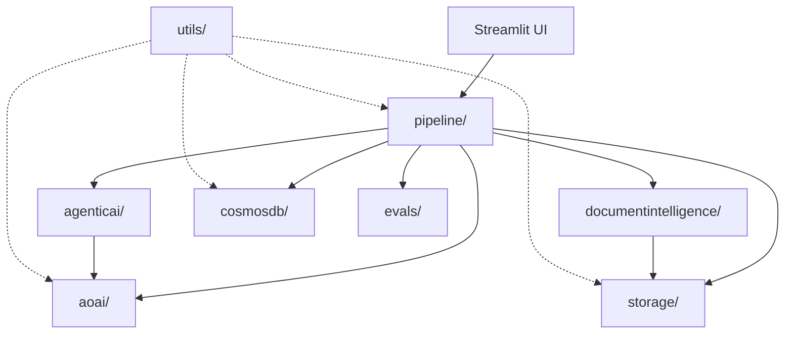
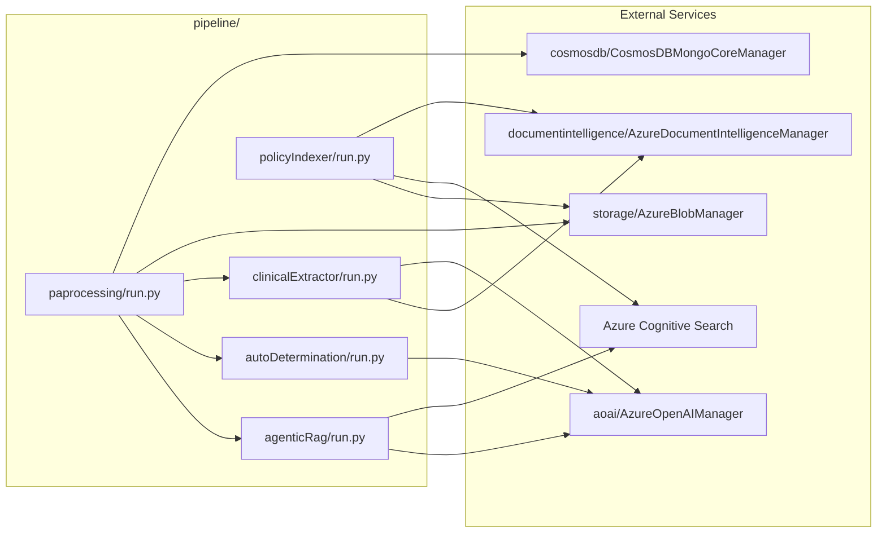
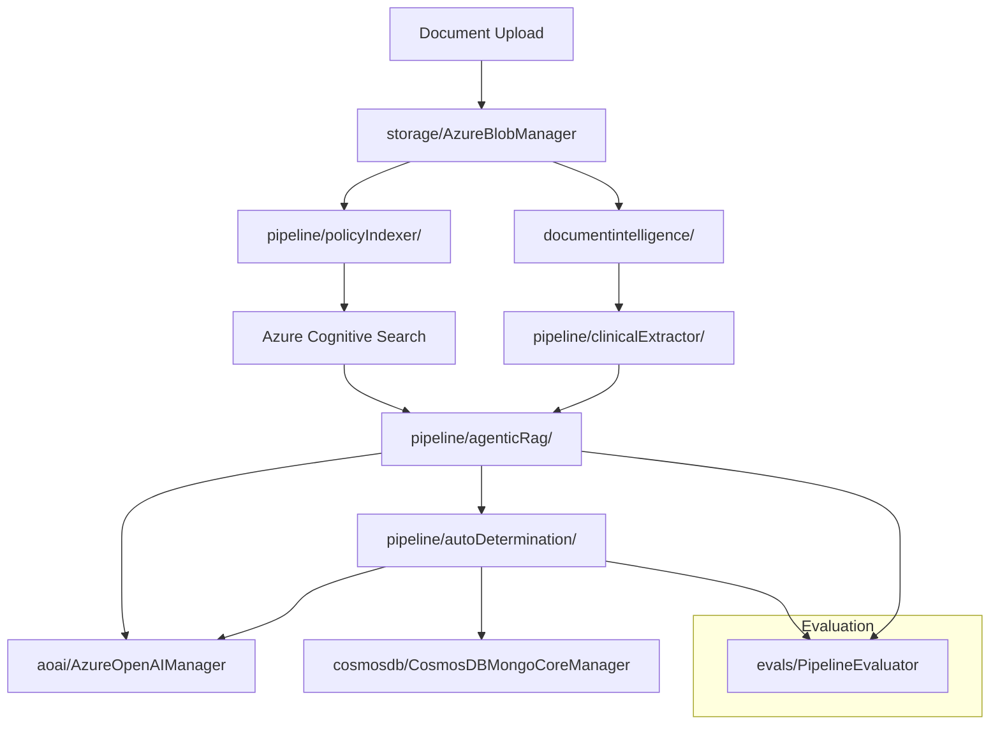

# AutoAuth Solution Accelerator - Source Code Overview

This directory contains the core business logic and infrastructure for the AutoAuth solution accelerator, organized into modular components that handle different aspects of the automated prior authorization workflow.

## Module Overview

The `src` directory follows a layered architecture with distinct responsibilities:

| Module | Purpose | Key Components |
|--------|---------|----------------|
| **`agenticai/`** | Agentic orchestration and skills management | Agent class, Skills manager, plugins |
| **`aoai/`** | Azure OpenAI integration | AzureOpenAIManager, tokenization utilities |
| **`cosmosdb/`** | Document database operations | CosmosDBMongoCoreManager for data persistence |
| **`documentintelligence/`** | Document processing & OCR | AzureDocumentIntelligenceManager for text extraction |
| **`storage/`** | Blob storage operations | AzureBlobManager for file management |
| **`pipeline/`** | Business logic orchestration | RAG, indexing, PA processing pipelines |
| **`evals/`** | Evaluation framework | PipelineEvaluator, test harnesses |
| **`extractors/`** | Data extraction utilities | PDF processing, OCR helpers |
| **`utils/`** | Shared utilities | Logging, configuration, helpers |

## Architecture Overview

### High-Level System Flow



### Pipeline-Centric Architecture



### Data Flow Architecture



## Module Detailed Descriptions

### Core Service Modules

#### `aoai/` - Azure OpenAI Integration
- **Purpose**: Manages all interactions with Azure OpenAI services
- **Key Components**:
  - `AzureOpenAIManager`: Main interface for LLM operations
  - Tokenization utilities for prompt optimization
  - Chat completion handling with retry logic
- **Usage**: Used across all pipelines for LLM-powered reasoning, query expansion, and evaluation

#### `storage/` - Azure Blob Storage Management
- **Purpose**: Handles file operations and blob storage interactions
- **Key Components**:
  - `AzureBlobManager`: Core storage operations
  - Upload/download utilities
  - Container management
- **Usage**: Stores policy documents, clinical files, and processed artifacts

#### `cosmosdb/` - Document Database Operations
- **Purpose**: Provides persistent storage for structured data
- **Key Components**:
  - `CosmosDBMongoCoreManager`: Database operations
  - Case management and audit trails
  - Query optimization for large datasets
- **Usage**: Stores case information, processing results, and evaluation metrics

#### `documentintelligence/` - Document Processing
- **Purpose**: Extracts structured data from unstructured documents
- **Key Components**:
  - `AzureDocumentIntelligenceManager`: OCR and entity extraction
  - Image processing utilities
  - Layout analysis capabilities
- **Usage**: Processes clinical documents and policy PDFs for text extraction

### Business Logic Modules

#### `pipeline/` - Core Business Workflows
- **Purpose**: Orchestrates end-to-end business processes
- **Key Components**:
  - `agenticRag/`: Intelligent retrieval and reasoning
  - `policyIndexer/`: Document indexing pipeline
  - `paprocessing/`: Prior authorization workflow
  - `autoDetermination/`: AI-driven decision making
  - `clinicalExtractor/`: Clinical data extraction
  - `promptEngineering/`: Prompt management and optimization

#### `agenticai/` - Agentic AI Framework
- **Purpose**: Provides intelligent agent capabilities with dynamic skill loading
- **Key Components**:
  - `Agent`: Main agent orchestrator
  - `Skills`: Plugin management system
  - Dynamic function calling capabilities
- **Usage**: Enables complex AI workflows with modular, reusable skills

### Support Modules

#### `evals/` - Evaluation Framework
- **Purpose**: Standardized testing and evaluation across all pipelines
- **Key Components**:
  - `PipelineEvaluator`: Base evaluation class
  - Test case management
  - Metrics collection and analysis
- **Usage**: Validates pipeline performance and accuracy

#### `extractors/` - Data Extraction Utilities
- **Purpose**: Specialized data extraction tools
- **Key Components**:
  - PDF processing utilities
  - OCR helpers and optimizations
  - Format conversion tools
- **Usage**: Supporting utilities for document processing workflows

#### `utils/` - Shared Infrastructure
- **Purpose**: Common utilities and configuration management
- **Key Components**:
  - Logging framework (`ml_logging`)
  - Configuration loaders
  - Helper functions
- **Usage**: Foundation layer used across all modules

## Key Interconnection Patterns

### 1. Service Dependencies
All pipeline modules follow a common pattern:
```python
# Common initialization pattern
config = load_config()  # from utils/
aoai_manager = AzureOpenAIManager()  # from aoai/
blob_manager = AzureBlobManager()    # from storage/
cosmos_manager = CosmosDBMongoCoreManager()  # from cosmosdb/
```

### 2. Agentic Orchestration
The agentic framework enables dynamic skill loading:
```python
# Agent instantiation with skills
agent = Agent(skills=["retrieval", "evaluation", "rewriting"])
agent._load_skills()  # Dynamically loads plugin functions
```

### 3. Evaluation Integration
Each pipeline has corresponding evaluators that extend the base framework:
```python
# Standardized evaluation pattern
evaluator = PipelineEvaluator(pipeline_class=AgenticRAG)
results = evaluator.run_evaluation(test_cases)
```

### 4. Configuration Flow
Configuration cascades from utils through all modules:

```mermaid
block-beta
    columns 3
    Config[utils/config] --> Pipeline[pipeline/]
    Config --> Services[Service Modules]
    Pipeline --> Services
    Services --> Evaluation[evals/]
```

## Usage Examples

### Initializing a Complete Pipeline
```python
from src.pipeline.paprocessing.run import PAProcessingPipeline

# Initialize with all dependencies
pipeline = PAProcessingPipeline(
    case_id="TEST-001",
    config_path="config/settings.yaml"
)

# Run end-to-end processing
results = await pipeline.run(
    uploaded_files=["document1.pdf", "document2.pdf"],
    clinical_info="Patient diagnosis and treatment request"
)
```

### Using Individual Components
```python
from src.aoai.aoai_helper import AzureOpenAIManager
from src.storage.blob_helper import AzureBlobManager

# Use individual services
aoai = AzureOpenAIManager()
storage = AzureBlobManager()

# Process documents
blob_url = storage.upload_file("document.pdf")
response = await aoai.chat_completion("Analyze this document")
```

## Best Practices

1. **Modular Design**: Each module has a single responsibility and clear interfaces
2. **Configuration Management**: All settings are externalized to YAML configurations
3. **Error Handling**: Comprehensive logging and error handling across all modules
4. **Async Operations**: Asynchronous programming for better performance
5. **Evaluation-Driven Development**: All pipelines include corresponding evaluation frameworks

This modular architecture enables **separation of concerns**, **reusability**, and **testability** across the entire AutoAuth solution accelerator.
