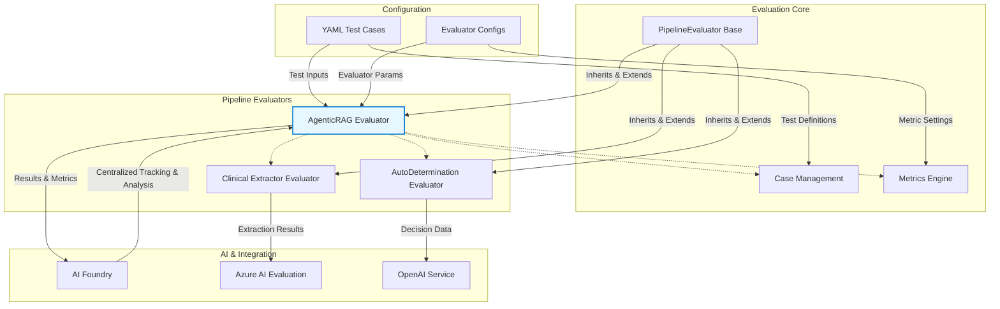
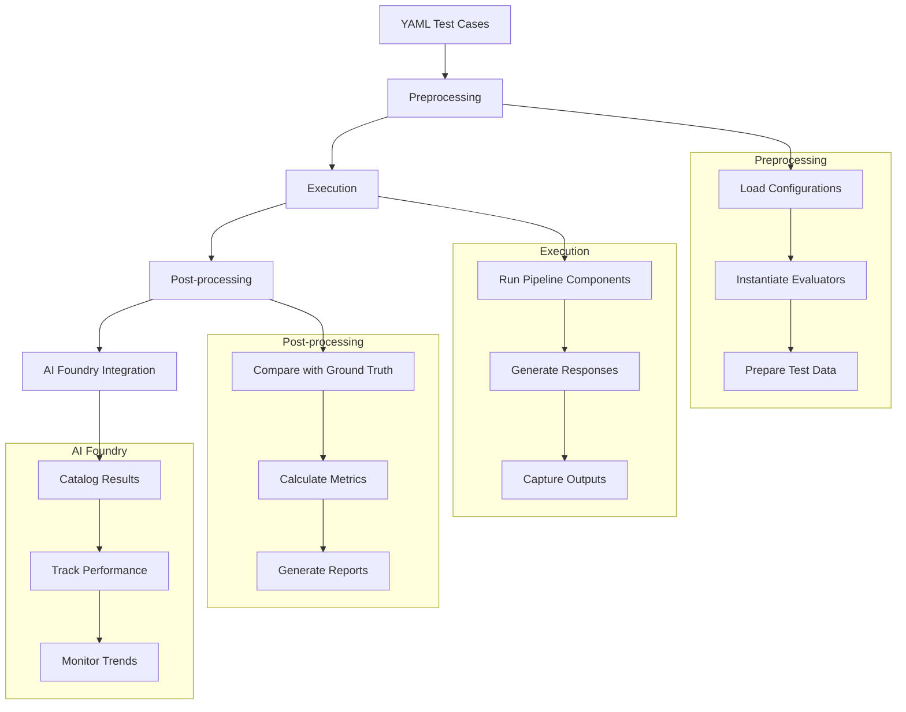
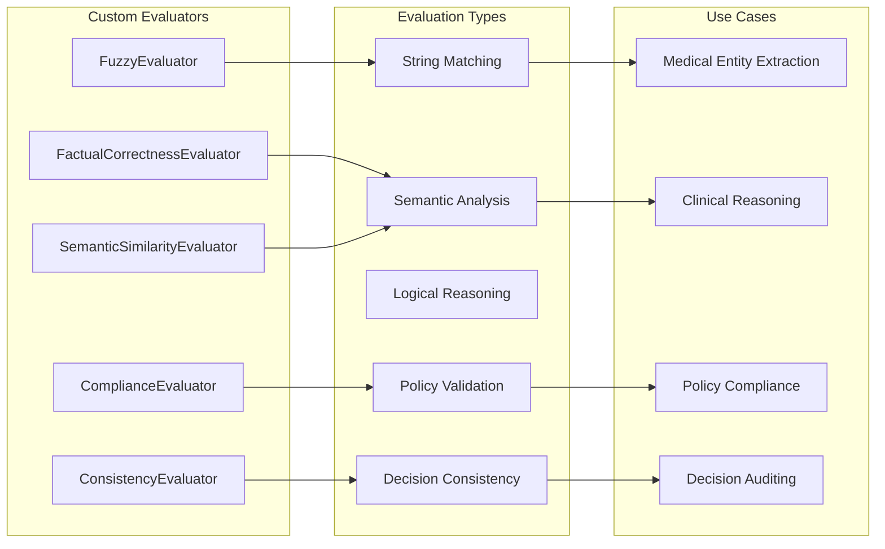
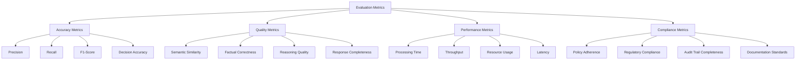
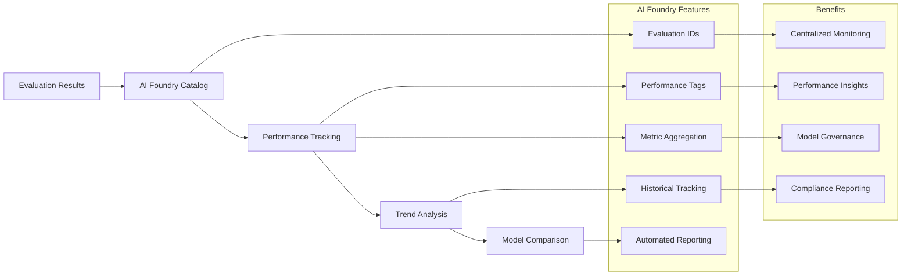

# AutoAuth LLM Evaluation Framework

## Overview

The AutoAuth project implements a comprehensive LLM evaluation framework designed to assess the performance of agentic workflows across different healthcare prior authorization scenarios. The framework provides standardized evaluation pipelines, custom evaluators, and seamless integration with Azure AI evaluation services for comprehensive metric tracking and analysis.

## Architecture Overview

The evaluation framework is built around a modular architecture that enables standardized evaluation workflows across different pipeline types while maintaining flexibility for custom evaluators and metrics.


**Architecture Emphasis:**
The **AgenticRAG Evaluator** is the central orchestrator of the evaluation framework. It receives direct inputs from both configuration and case management, leverages the core evaluation logic, and coordinates with other evaluators as needed. Critically, its results and metrics are funneled into **AI Foundry** for centralized tracking, analysis, and reporting—making AgenticRAG the primary bridge between all evaluation workflows and the AI Foundry platform.

## Evaluation Workflow

The framework follows a standardized 3-step evaluation process across all pipeline types:



## Pipeline-Specific Evaluators

### 1. AgenticRAG Evaluator

Evaluates the performance of the agentic RAG (Retrieval-Augmented Generation) pipeline for policy reasoning and recommendation generation.

**Key Metrics:**
- **Factual Correctness**: Validates factual accuracy of generated responses
- **Semantic Similarity**: Measures semantic alignment with expected outputs
- **Policy Coverage**: Ensures comprehensive policy consideration
- **Reasoning Quality**: Assesses logical flow and justification

**Sample Configuration:**
```yaml
test_case: "agentic-rag-policies-001"
description: "Test policy reasoning for cardiology procedures"
input:
  request_type: "prior_authorization"
  procedure_code: "93458"
  medical_condition: "coronary artery disease"
expected_output:
  recommendation: "approved"
  reasoning: "Procedure medically necessary based on symptoms"
  policy_references: ["CARD_001", "DIAG_002"]
evaluators:
  - name: "factual_correctness"
    threshold: 0.8
  - name: "semantic_similarity"
    threshold: 0.75
```

### 2. Clinical Extractor Evaluator

Assesses the accuracy of clinical data extraction from medical documents and forms.

**Key Metrics:**
- **Entity Extraction Accuracy**: Precision/recall for medical entities
- **Field Mapping Accuracy**: Correct mapping to structured fields
- **Confidence Scores**: Reliability of extraction confidence
- **Processing Time**: Performance efficiency metrics

**Sample Configuration:**
```yaml
test_case: "clinical-extraction-001"
description: "Extract patient demographics and conditions"
input:
  document_type: "prior_auth_form"
  file_path: "test_documents/pa_form_001.pdf"
expected_output:
  patient_name: "John Doe"
  date_of_birth: "1985-03-15"
  diagnosis_codes: ["I25.10", "E11.9"]
  procedure_requested: "93458"
evaluators:
  - name: "entity_extraction"
    entities: ["patient_name", "diagnosis_codes"]
  - name: "field_mapping"
    required_fields: ["patient_demographics", "clinical_data"]
```

### 3. AutoDetermination Evaluator

Evaluates automated prior authorization decision-making accuracy and consistency.

**Key Metrics:**
- **Decision Accuracy**: Correctness of approve/deny decisions
- **Consistency**: Uniform decisions for similar cases
- **Compliance**: Adherence to policy guidelines
- **Audit Trail**: Completeness of decision reasoning

**Sample Configuration:**
```yaml
test_case: "autodetermination-decision-001"
description: "Automated PA decision for routine procedure"
input:
  patient_data: "test_patients/patient_001.json"
  procedure_code: "99213"
  insurance_plan: "commercial_standard"
expected_output:
  decision: "approved"
  confidence: 0.95
  reasoning: "Meets standard criteria for routine office visit"
  required_documentation: []
evaluators:
  - name: "decision_accuracy"
    weight: 0.4
  - name: "consistency_check"
    weight: 0.3
  - name: "compliance_validation"
    weight: 0.3
```

## Custom Evaluators

The framework includes specialized evaluators for healthcare-specific requirements:



### FuzzyEvaluator
- **Purpose**: Flexible string matching with tolerance for variations
- **Use Case**: Medical terminology extraction with spelling variations
- **Configuration**: Adjustable similarity thresholds and normalization

### FactualCorrectnessEvaluator
- **Purpose**: Validates factual accuracy using domain knowledge
- **Use Case**: Clinical recommendation accuracy assessment
- **Integration**: Azure AI evaluation services for medical fact checking

### SemanticSimilarityEvaluator
- **Purpose**: Measures semantic meaning alignment
- **Use Case**: Reasoning quality assessment across different phrasings
- **Technology**: Embedding-based similarity using Azure OpenAI

## Evaluation Metrics Framework

### Metric Categories



### Metric Selection Guidelines

| Pipeline Type | Primary Metrics | Secondary Metrics | Threshold Recommendations |
|---------------|----------------|------------------|-------------------------|
| **AgenticRAG** | Factual Correctness, Semantic Similarity | Policy Coverage, Reasoning Quality | 0.8+, 0.75+ |
| **Clinical Extractor** | Entity Accuracy, Field Mapping | Confidence Scores, Processing Time | 0.9+, 0.85+ |
| **AutoDetermination** | Decision Accuracy, Consistency | Compliance, Audit Trail | 0.95+, 0.9+ |

## Configuration Management

### YAML Test Case Structure

```yaml
# Test Case Template
test_case: "unique-identifier"
description: "Human-readable description"
category: "evaluation-category"
priority: "high|medium|low"

input:
  # Test input parameters
  request_type: "prior_authorization"
  data_source: "file_path_or_inline_data"

expected_output:
  # Ground truth for comparison
  decision: "expected_decision"
  reasoning: "expected_reasoning"
  confidence: "expected_confidence_score"

evaluators:
  - name: "evaluator_name"
    weight: 0.5
    threshold: 0.8
    parameters:
      custom_param: "value"

metadata:
  tags: ["tag1", "tag2"]
  author: "test_author"
  created_date: "2024-01-01"
  last_modified: "2024-01-15"
```

### Environment Configuration

```yaml
# evaluation_config.yaml
evaluation:
  default_thresholds:
    accuracy: 0.8
    semantic_similarity: 0.75
    factual_correctness: 0.85

  ai_foundry:
    enabled: true
    project_name: "autoauth-evaluations"
    experiment_prefix: "eval"

  azure_ai:
    endpoint: "${AZURE_AI_ENDPOINT}"
    api_key: "${AZURE_AI_KEY}"

  output:
    format: ["json", "csv", "html"]
    directory: "./evaluation_results"
    include_detailed_logs: true
```

## AI Foundry Integration

The framework seamlessly integrates with Azure AI Foundry for comprehensive evaluation tracking and analysis:



### Integration Features

- **Automatic Cataloging**: All evaluation runs are automatically cataloged with unique IDs
- **Performance Tags**: Results tagged with pipeline type, test category, and performance metrics
- **Metric Aggregation**: Cross-run analysis and performance trending
- **Historical Tracking**: Long-term performance monitoring and regression detection

## Getting Started

### 1. Environment Setup

```bash
# Install dependencies
pip install -r requirements.txt

# Set environment variables
export AZURE_OPENAI_ENDPOINT="your-endpoint"
export AZURE_OPENAI_API_KEY="your-key"
export AI_FOUNDRY_ENDPOINT="your-foundry-endpoint"
```

### 2. Create Test Cases

```bash
# Create new test case
cp evals/cases/_.yaml.example evals/cases/my-test-001.yaml
# Edit configuration as needed
```

### 3. Run Evaluations

```python
from src.evals.pipeline import PipelineEvaluator
from src.pipeline.agenticRag.evaluator import AgenticRagEvaluator

# Initialize evaluator
evaluator = AgenticRagEvaluator()

# Run evaluation
results = evaluator.evaluate_test_case("my-test-001.yaml")

# View results
print(f"Overall Score: {results.overall_score}")
print(f"Detailed Metrics: {results.metrics}")
```

### 4. Monitor Results

Access AI Foundry dashboard to monitor evaluation results, track performance trends, and generate compliance reports.

## Best Practices

### Evaluation Design
- **Comprehensive Coverage**: Include positive, negative, and edge cases
- **Ground Truth Quality**: Ensure high-quality expected outputs from domain experts
- **Metric Balance**: Use multiple complementary metrics for comprehensive assessment
- **Threshold Calibration**: Set appropriate thresholds based on business requirements

### Test Case Management
- **Version Control**: Track test case changes and maintain versioning
- **Documentation**: Include clear descriptions and expected behaviors
- **Organization**: Group related test cases by functionality or domain
- **Regular Updates**: Keep test cases current with evolving requirements

### Performance Optimization
- **Batch Processing**: Evaluate multiple test cases in batches for efficiency
- **Caching**: Cache intermediate results to avoid redundant computations
- **Parallel Execution**: Leverage parallel processing for independent evaluations
- **Resource Monitoring**: Track and optimize resource usage during evaluations

## Troubleshooting

### Common Issues

1. **Evaluation Failures**
   - Check YAML syntax and required fields
   - Verify environment variables and API keys
   - Ensure test data files are accessible

2. **Performance Issues**
   - Monitor Azure AI service quotas and limits
   - Optimize batch sizes for large test suites
   - Check network connectivity and latency

3. **Metric Inconsistencies**
   - Validate ground truth data quality
   - Review evaluator configurations and thresholds
   - Check for data preprocessing issues

### Debug Mode

Enable detailed logging for troubleshooting:

```python
import logging
logging.basicConfig(level=logging.DEBUG)

# Run evaluation with detailed logs
evaluator.evaluate_test_case("test-case.yaml", debug=True)
```

## Contributing

### Adding Custom Evaluators

1. Inherit from `PipelineEvaluator` base class
2. Implement required methods: `preprocess()`, `execute()`, `postprocess()`
3. Add evaluator-specific metrics and configurations
4. Create comprehensive test cases
5. Update documentation and examples

### Test Case Guidelines

- Follow YAML schema requirements
- Include diverse test scenarios
- Provide clear ground truth definitions
- Add metadata for categorization and tracking
- Validate configurations before submission

## Advanced Features

### Custom Metrics Development

```python
from src.evals.base import BaseEvaluator

class CustomMetricEvaluator(BaseEvaluator):
    def __init__(self, config):
        super().__init__(config)
        self.metric_name = "custom_metric"

    def evaluate(self, predicted, expected):
        # Implement custom metric logic
        score = self.calculate_custom_score(predicted, expected)
        return {
            "score": score,
            "details": self.get_metric_details()
        }
```

### Batch Evaluation Scripts

```python
# Batch evaluation example
from src.evals.batch import BatchEvaluator

batch_evaluator = BatchEvaluator()
results = batch_evaluator.run_test_suite(
    test_directory="evals/cases/",
    output_directory="results/",
    parallel_jobs=4
)
```

This comprehensive evaluation framework ensures robust assessment of the AutoAuth system's AI capabilities while providing the flexibility and scalability needed for healthcare applications.
